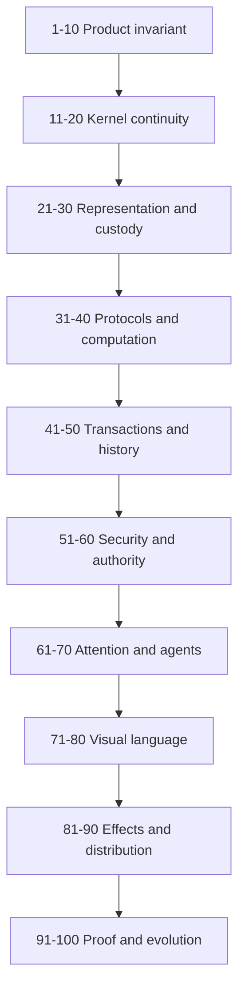

# ArchHub Universal Cell 100-Layer Architecture

Status: WIP explanatory and candidate-detail compendium

Founder requirement: 2026-07-31, document the existing twenty architecture
layers and descend eighty layers deeper.

This document is not a second specification, implementation evidence, a
completion claim, or a release decision. `AUTHORITY.md` decides precedence and
`SPEC.md` remains the normative product target. A layer marked **Restatement**
explains an existing requirement. A layer marked **Candidate detail** records a
research-backed design that still requires the authority-change protocol before
it can control implementation.

Every layer answers the founder's recursive documentation contract:

1. **WHAT** exists at this depth?
2. **WHY** is it required?
3. **HOW** does it work?
4. **WHO** owns or acts on it?
5. **WHEN** is it evaluated or changed?
6. **WHERE** does semantic authority and physical execution live?
7. **EXAMPLE** makes the mechanism concrete.
8. **FAILURE** shows how the design can be falsified.
9. **PROOF TARGET** states evidence required before acceptance.

The one hundred layers are a recursive review and construction index. They are
not one hundred deployable services, tables, node kinds, or sequential runtime
tiers. All persisted semantic facts remain compositions of the same four-field
Cell.



## Reading Rules

- `[Ixx]` references an internal controlling or explanatory source.
- `[Exx]` references primary literature or an official technical standard.
- External sources are research lineage, not ArchHub authority.
- A proof target is not a claim that the proof currently passes.
- No layer may introduce a persisted semantic shape other than
  `Cell(id, link0, link1, atom)`.
- No candidate detail may silently become host dispatch, a semantic side table,
  or a copied control plane.

# Stratum A - Product And Semantic Foundation

## Layer 1: The Physical Cell

- **AUTHORITY:** Restatement of `SPEC.md` sections 1 and 3.
- **WHAT:** Every persisted semantic fact is composed from
  `Cell(id, link0, link1, atom)`.
- **WHY:** One physical shape prevents product concepts from becoming privileged
  classes that users cannot inspect, rewire, or reuse.
- **HOW:** Stable identity, two raw incidences, and opaque bytes combine through
  graph-held protocols. The kernel assigns no product meaning.
- **WHO:** Floor maintainers implement storage; authorised authors compose
  meaning; ordinary users interact through released assemblies.
- **WHEN:** The invariant applies at creation, import, commit, restore, migration,
  and replay.
- **WHERE:** Semantic facts live in the accepted Cell graph. Database pages,
  buffers, and process memory remain physical machinery.
- **EXAMPLE:** A parameter and an AI session have the same physical Cell anatomy
  even though their surrounding compositions differ.
- **FAILURE:** A persisted `kind="session"` or nested `params` record creates a
  second ontology.
- **PROOF TARGET:** Uniform-Cell and semantic-side-table courts inspect every
  persisted path and force reconstruction from Cells alone. [I02]

## Layer 2: Meaning From Released Protocols

- **AUTHORITY:** Restatement of `SPEC.md` section 4.1.
- **WHAT:** Meaning is resolved from exact released protocol compositions, not
  labels, classes, table names, or operation strings.
- **WHY:** A universal record is meaningless if Python or JavaScript secretly
  decides what each product name does.
- **HOW:** The interpreter follows protocol relations from a semantic root,
  matches graph structure, and applies bounded graph-held rules.
- **WHO:** Protocol authors propose definitions; courts and authorised reviewers
  release revisions; interpreters consume exact digests.
- **WHEN:** Resolution occurs on traversal, validation, rendering, rewrite, and
  invocation preparation.
- **WHERE:** Meaning lives in protocol roots inside the graph; execution of the
  minimal floor lives in audited host code.
- **EXAMPLE:** Addition resolves through an arithmetic protocol revision rather
  than `if node.type == "math"`.
- **FAILURE:** Renaming a node changes behavior because the renderer dispatches
  on its title.
- **PROOF TARGET:** Rename, rewire, delete-fast-path, and graph-versus-host
  equivalence courts. [I02] [E04]

## Layer 3: Relations And Wires

- **AUTHORITY:** Restatement of `SPEC.md` section 4.2.
- **WHAT:** A relation is an identifiable composition with explicit incidences,
  participant roles, policy, lifecycle, provenance, and presentation.
- **WHY:** A line between boxes cannot express n-ary participation, gates,
  transforms, encryption, ordering, or evidence.
- **HOW:** Relation and incidence roots connect participants. A visible cable is
  an authorised lens over those exact roots.
- **WHO:** Users manipulate permitted relations; protocol authors define
  contracts; renderers project without inventing endpoints.
- **WHEN:** Relations are evaluated when traversed, edited, validated, rendered,
  authorized, or used by a rule.
- **WHERE:** Relation semantics live in Cells; curve geometry and hit testing are
  disposable renderer state.
- **EXAMPLE:** A BIM approval relates model revision, checker, requirement,
  evidence, policy, and decision as six participants.
- **FAILURE:** A two-endpoint SVG cable hides a validation gate and falsely
  implies direct authority.
- **PROOF TARGET:** Binary, n-ary, relation-of-relation, rewiring, encryption,
  provenance, and exact-incidence browser courts. [I02] [E01]

## Layer 4: Composition And Catalogue

- **AUTHORITY:** Restatement of `SPEC.md` sections 4.4 and 4.5.
- **WHAT:** Composition creates scope and reusable assemblies without a
  privileged Group Cell kind.
- **WHY:** Users need useful preassembled nodes, but hard-coded product classes
  would destroy universality and maintainability.
- **HOW:** A boundary relates internal identities to public interfaces. Released
  catalogue definitions expose parts, rules, parameters, courts, and versions.
- **WHO:** Authors build WIP definitions; reviewers release them; users and
  agents instantiate admitted revisions.
- **WHEN:** Boundaries change on group, ungroup, enter, exit, instantiate,
  revise, and promote.
- **WHERE:** Definitions and membership live in the graph; a search index is a
  disposable authorised projection.
- **EXAMPLE:** A Watcher is an openable assembly made from observation, pattern,
  cursor, policy, and outcome relations.
- **FAILURE:** The catalogue lists `Watcher`, `Database`, and `Session` as
  kernel-enforced node kinds.
- **PROOF TARGET:** Group/ungroup identity, released-definition binding, no
  hidden catalogue, and generic-instantiation courts. [I02] [E36] [E37]

## Layer 5: Transactions, Revisions, And Lifecycle

- **AUTHORITY:** Restatement of `SPEC.md` sections 3.2 and 8.
- **WHAT:** Every durable change is atomic, revisioned, append-oriented, and
  governed across independent lifecycle axes.
- **WHY:** Partial writes, one status string, or silent overwrite cannot preserve
  BIM, financial, security, or collaborative truth.
- **HOW:** A caller supplies an expected snapshot and complete replacement set;
  the authority accepts all or publishes nothing.
- **WHO:** Actors propose; policy authorizes; the CellStore commits; stewards and
  users review history and conflict.
- **WHEN:** Every mutation, merge, promotion, effect reconciliation, undo, and
  restore creates a new revision.
- **WHERE:** Semantic history lives in Cells and immutable revisions; WAL and
  database locks are physical mechanisms.
- **EXAMPLE:** WIP P03 can advance while Shared P01 and Published P00 remain
  immutable views.
- **FAILURE:** Changing `status="published"` mutates the only copy and destroys
  the reviewed version.
- **PROOF TARGET:** Atomicity, stale-snapshot, independent-lifecycle, branch,
  merge, replay, and recovery courts. [I02] [E12] [E13]

## Layer 6: Authority And Security

- **AUTHORITY:** Restatement of `SPEC.md` section 9.
- **WHAT:** Every read, projection, mutation, proposal, release, and effect is
  default-deny and relationship-aware.
- **WHY:** One graph increases the damage of an over-broad traversal unless
  authority is evaluated at every scale.
- **HOW:** Decisions bind actor, device, session, action, object, relationship,
  audience, classification, policy revision, time, and budget.
- **WHO:** Founders and delegated authorities release policy; subjects request;
  the policy court evaluates; adapters receive only bounded grants.
- **WHEN:** Authorization precedes candidate admission, traversal, ranking,
  rendering, commit, and invocation.
- **WHERE:** Policy and decision evidence live in the graph; private keys and
  live handles remain in admitted custody.
- **EXAMPLE:** A user may edit a project node but cannot infer a hidden client's
  existence through counts or search timing.
- **FAILURE:** The server loads all roots and filters the response after ranking.
- **PROOF TARGET:** Denial, revocation, confused-deputy, hidden-count, timing,
  cross-tenant, and relationship-causality courts. [I02] [E14] [E15] [E16]

## Layer 7: External Effects And Adapters

- **AUTHORITY:** Restatement of `SPEC.md` sections 3.2, 8, and 9.
- **WHAT:** `invoke` is the only physical effect boundary; adapters translate
  exact operations but do not own product workflow or policy.
- **WHY:** Filesystems, Revit, databases, networks, and providers are physical
  systems that cannot be replaced by graph description alone.
- **HOW:** Intent, authorization, attempt, provider outcome, reconciliation, and
  current projection remain separate compositions.
- **WHO:** The graph authorizes; an allowlisted adapter acts; the provider
  responds; reconciliation determines current truth.
- **WHEN:** Invocation follows an accepted authorized request and never runs
  merely because a model emitted text.
- **WHERE:** Workflow and receipts live in the graph; handles, sockets, SDK
  objects, and secret bytes live in the adapter host.
- **EXAMPLE:** A payment timeout becomes `outcome uncertain`, not `failed`, until
  provider reconciliation.
- **FAILURE:** An adapter sets `done=true` after receiving HTTP 200.
- **PROOF TARGET:** Admission, least-privilege, idempotency, ambiguity,
  reconciliation, revocation, and compensation courts. [I02] [E20] [E29]

## Layer 8: Brain, Attention, And Agents

- **AUTHORITY:** Restatement of `SPEC.md` sections 5, 6, and 9.
- **WHAT:** Brain is the memory, attention, obligation, evidence, and governance
  lens of the same graph; agents are governed session compositions.
- **WHY:** Model context and process memory disappear, drift, and cannot preserve
  durable focus or authority.
- **HOW:** Signal, Attention, Focus, Obligation, Decision, and Outcome
  compositions survive processes and link agents to exact work and evidence.
- **WHO:** Humans and admitted agents observe and propose; policy controls;
  independent courts verify; models cannot mint authority.
- **WHEN:** Attention updates after accepted commits and resumes from durable
  cursors after restart.
- **WHERE:** Durable cognition lives in the graph; inference runs in external
  models through bounded provider adapters.
- **EXAMPLE:** This Codex session possesses an Agent Session composition whose
  focus points at one documentation obligation.
- **FAILURE:** A Python Brain database and JSON Workshop copy the same task
  status and disagree.
- **PROOF TARGET:** Restart, cursor, assignment, identity, context-source,
  provider-replacement, and no-side-channel courts. [I02] [I03] [E45]

## Layer 9: UI And Lawful Lenses

- **AUTHORITY:** Restatement of `SPEC.md` sections 6 and 7.
- **WHAT:** The application, Brain, Cockpit, Grand Map, website, and Properties
  rail are authorised interactive projections of the same roots.
- **WHY:** Static dashboards and copied JSON prevent users from seeing cause,
  changing real state, and trusting what is displayed.
- **HOW:** Use, Build, Govern, and Floor lenses project progressively deeper
  authorised relations while preserving root identity.
- **WHO:** Users manipulate allowed state; renderers project; protocol-defined
  editors commit; experts may enter Floor under explicit grants.
- **WHEN:** Projection occurs at a bound snapshot and reconciles after accepted
  local or remote revisions.
- **WHERE:** Selection, focus, and scope authority live in graph view-session
  relations; pixels and transient previews live in the client.
- **EXAMPLE:** Selecting a relation opens its actual gates, incidences, policy,
  history, and presentation in the Properties rail.
- **FAILURE:** A tab is visible but has no graph interaction or commit path.
- **PROOF TARGET:** Same-root, no-dead-tab, direct-manipulation, accessibility,
  exact-interface, and real-browser courts. [I02] [I04] [E32] [E33]

## Layer 10: Cloud, Devices, And Migration

- **AUTHORITY:** Restatement of `SPEC.md` sections 8, 9, and 12.
- **WHAT:** One logical graph authority may use many physical replicas,
  processes, stores, and devices without creating competing semantic truth.
- **WHY:** ArchHub must continue across devices and failures without being jailed
  by one machine or split into synchronized products.
- **HOW:** Accepted revisions have one ancestry; online writes use a fenced
  authority; offline work uses explicit signed branches and governed merge.
- **WHO:** The cloud authority commits; devices project and propose; recovery
  operators restore; founder-approved migration switches authority.
- **WHEN:** Synchronization follows commits, reconnect, failover, migration, and
  restore; legacy retirement follows no-fallback proof.
- **WHERE:** The semantic head is one graph authority; replicas, object stores,
  and caches are physical distribution.
- **EXAMPLE:** A laptop continues from the same accepted project root after the
  desktop becomes unavailable.
- **FAILURE:** Local SQLite and cloud PostgreSQL both accept independent writes
  to `app:archhub`.
- **PROOF TARGET:** Fencing, split-brain, two-device continuity, offline branch,
  restore, digest equality, and legacy-retirement courts. [I02] [I06] [I07] [E24]

# Stratum B - Kernel Continuity And Deep Mechanics

## Layer 11: Stable Identity And Canonical Bytes

- **AUTHORITY:** Candidate detail constrained by `SPEC.md` section 3.1.
- **WHAT:** Stable `CellId`, exact Cell-version digest, and snapshot digest are
  separate identities with deterministic byte encodings.
- **WHY:** Semantic identity must survive editing while cryptographic evidence
  must identify exact content.
- **HOW:** A released encoding binds version, Cell identity, links, atom length,
  and exact bytes before hashing with domain separation.
- **WHO:** Floor maintainers implement codecs; security reviewers release them;
  all writers and verifiers use the same revision.
- **WHEN:** Encoding occurs on commit, transport, signature, backup, replay, and
  verification.
- **WHERE:** Exact bytes live in physical journal envelopes; codec semantics and
  release references live in the graph.
- **EXAMPLE:** Cell `C7` retains identity while its P04 content receives a new
  digest.
- **FAILURE:** Signing JSON succeeds at write time but fails after key ordering
  or number representation changes.
- **PROOF TARGET:** Golden vectors, cross-language encoding, mutation,
  non-canonical rejection, and digest-domain courts. [E02] [E07] [E09]

## Layer 12: Snapshot And Commit Chain

- **AUTHORITY:** Candidate detail constrained by `SPEC.md` sections 3.2 and 8.
- **WHAT:** Every accepted revision commits one immutable snapshot ancestry and
  binds the exact protocol, policy, and catalogue roots used.
- **WHY:** A revision number alone cannot prove content, interpretation, or
  authorization context.
- **HOW:** The commit envelope references its parent digest, changed Cell
  versions, release roots, actor proof, and resulting snapshot digest.
- **WHO:** The commit authority issues; replicas verify; courts and recovery
  tools reconstruct independently.
- **WHEN:** Every accepted mutation, merge, migration, and restored continuation
  extends or deliberately selects ancestry.
- **WHERE:** Semantic ancestry is graph-held; ordered journal records and
  cryptographic checksums are physical durability mechanisms.
- **EXAMPLE:** Revision 1043 proves it descended from 1042 under policy P17 and
  protocol set R22.
- **FAILURE:** Two stores both report revision 1043 but contain different Cells.
- **PROOF TARGET:** Chain reconstruction, fork detection, policy/protocol
  binding, corruption, and independent witness courts. [I06] [E11]

## Layer 13: Signed Bootstrap And Trusted Base

- **AUTHORITY:** Candidate detail; no accepted bootstrap format yet controls.
- **WHAT:** A minimal signed manifest identifies the floor version, null Cell,
  accepted snapshot, and root protocol, policy, catalogue, and constitution.
- **WHY:** A graph cannot interpret itself from nothing; eliminating every
  trusted starting point is impossible.
- **HOW:** Startup verifies executable and manifest signatures, snapshot digest,
  and root reachability before loading graph-held protocols.
- **WHO:** Release authority signs; runtime verifies; agents cannot replace the
  trust anchor.
- **WHEN:** Every cold start, upgrade, failover, restore, and migration invokes
  bootstrap verification.
- **WHERE:** The signed manifest is a release artifact mirrored by graph
  evidence; product semantics remain in referenced Cells.
- **EXAMPLE:** A runtime refuses a valid database whose manifest points at an
  unapproved policy root.
- **FAILURE:** Host code recognizes `Brain` and `Session` while claiming the
  graph is self-describing.
- **PROOF TARGET:** Wrong signer, wrong root, downgrade, missing root, rollback,
  and reproducible-bootstrap courts. [I01] [I02] [E41] [E42]

## Layer 14: Pattern, Binding, And Rewrite

- **AUTHORITY:** Candidate detail constrained by the six floor operations.
- **WHAT:** Computation consists of bounded structural match, explicit bindings,
  graph-held guards, proposed construction, and atomic commit.
- **WHY:** Hidden functions or arbitrary code atoms would make behavior opaque
  and ungovernable.
- **HOW:** A released rule relates pattern, guard, construction, budget, failure,
  and authority roots; evaluation is pure until commit or `invoke`.
- **WHO:** Authors compose rules; interpreters evaluate; policy authorizes;
  courts test determinism and limits.
- **WHEN:** Rules run after an explicit command or observed accepted revision,
  never from unbounded ambient polling.
- **WHERE:** Rule meaning lives in Cells; matching and commit machinery live in
  the audited floor.
- **EXAMPLE:** A comparison assembly binds two value roots and constructs an
  outcome relation without calling product-specific Python.
- **FAILURE:** A string `op="topsis"` selects a hidden algorithm.
- **PROOF TARGET:** Alpha-renaming, exact bindings, guard denial, budget,
  deterministic failure, and host-equivalence courts. [E04] [E05] [E06]

## Layer 15: Executable Interfaces And Relations

- **AUTHORITY:** Restatement plus candidate detail under `SPEC.md` sections 4.2-4.4.
- **WHAT:** Interfaces expose permitted semantic roots; relations connect exact
  incidences through compatible contracts, gates, and transforms.
- **WHY:** Fake ports and magical compatibility make wiring decorative rather
  than causal.
- **HOW:** Compatibility is a graph match over protocol, cardinality,
  constraints, authority, lifecycle, and optional adapter compositions.
- **WHO:** Definition authors expose; users connect; validators check; renderers
  show exact accepted routes.
- **WHEN:** Validation runs during preview, commit, protocol upgrade, scope
  change, and execution.
- **WHERE:** Interfaces, incidences, and compatibility evidence live in the
  graph; socket positions are presentation projections.
- **EXAMPLE:** A geometry output connects to a coordinate transform before a
  renderer input.
- **FAILURE:** Two sockets connect because both are colored blue.
- **PROOF TARGET:** Cardinality, direction, n-ary, transform, gate, encryption,
  and incompatible-wire denial courts. [I02] [E38] [E40]

## Layer 16: Incremental Evaluation And Persistent Attention

- **AUTHORITY:** Restatement plus candidate detail under `SPEC.md` section 5.
- **WHAT:** Accepted changes drive bounded dependency deltas, watchers, signals,
  and durable cursors instead of whole-graph recomputation.
- **WHY:** Rebuilding millions of Cells on every pointer action cannot meet the
  interaction budget or recover attention after failure.
- **HOW:** A commit exposes changed identities; disposable reverse indexes find
  affected paths; graph-held cursors and deduplication guard durable reactions.
- **WHO:** The store emits; schedulers accelerate; watchers react; recovery
  resumes; stewards inspect obligations.
- **WHEN:** Only after durable commit, and again after restart when an accepted
  cursor is behind.
- **WHERE:** Signal, watcher, cursor, and outcome semantics live in Cells;
  dependency indexes and queues are disposable.
- **EXAMPLE:** Editing one weight recalculates one ranking assembly rather than
  the whole application.
- **FAILURE:** A memoized dependent returns stale data because invalidation
  removed only the edited Cell.
- **PROOF TARGET:** Dependency completeness, stale-cache, crash-between-commit-
  and-reaction, deduplication, and performance courts. [I02] [I03]

## Layer 17: Information-Flow Security

- **AUTHORITY:** Restatement plus candidate detail under `SPEC.md` section 9.
- **WHAT:** Authorization constrains not only returned objects but candidate
  admission, traversal, ranking, caching, timing, explanation, and context.
- **WHY:** Hidden data can leak without appearing directly.
- **HOW:** Projection keys bind snapshot, subject, session, audience, policy,
  lens, and classification; unauthorized roots never enter evaluation.
- **WHO:** Policy authors define; the evaluator enforces; security courts attack;
  clients receive bounded projections.
- **WHEN:** Before every read path and again when relevant authority changes.
- **WHERE:** Decisions and policy live in the graph; enforcement occurs at every
  query, index, model, renderer, and transport boundary.
- **EXAMPLE:** A hidden client project does not alter visible result counts or
  ranking latency.
- **FAILURE:** Search embeds all projects, then masks forbidden result labels.
- **PROOF TARGET:** Noninterference, cache-key, ranking, timing, embedding,
  revocation, and cross-audience courts. [E14] [E15] [E16]

## Layer 18: Effect Uncertainty And Reconciliation

- **AUTHORITY:** Restatement plus candidate detail under `SPEC.md` section 8.
- **WHAT:** External execution records uncertainty explicitly and never equates
  dispatch, acknowledgement, provider outcome, and settlement.
- **WHY:** Network loss makes exactly-once knowledge impossible without a
  provider-supported identity and reconciliation contract.
- **HOW:** Stable intent and attempt identities support safe retry; provider
  evidence and later queries reconcile actual state; compensation adds history.
- **WHO:** The graph requests; policy authorizes; adapter dispatches; provider
  acts; reconciler observes; user governs ambiguity.
- **WHEN:** Before dispatch, after every response or timeout, on recovery, and
  until terminal reconciliation.
- **WHERE:** Intent and receipts live in the graph; network and provider state
  remain physical external reality.
- **EXAMPLE:** A lost bank response produces `unknown`, then reconciles to
  `settled` using the provider transaction identity.
- **FAILURE:** Automatic retry creates a duplicate charge.
- **PROOF TARGET:** Timeout-before-send, timeout-after-send, duplicate response,
  replay, compensation, and provider-drift courts. [E28] [E29]

## Layer 19: Replication And Offline Work

- **AUTHORITY:** Candidate detail constrained by `SPEC.md` sections 8, 9, and 12.
- **WHAT:** One accepted online history coexists with verified replicas and
  explicit offline WIP branches.
- **WHY:** Availability across devices must not create silent competing
  authorities.
- **HOW:** A consensus-backed or otherwise fenced authority orders accepted
  commits; offline devices sign work against an exact base and merge visibly.
- **WHO:** Authority replicas agree; devices branch; merge policy and reviewers
  decide conflicts; recovery operators preserve fencing.
- **WHEN:** Online commits replicate immediately; offline work reconciles on
  reconnect; failover requires an exclusive epoch.
- **WHERE:** Accepted semantic history is one graph; replica logs and local
  stores are physical copies with explicit status.
- **EXAMPLE:** Two devices edit the same parameter offline and return a visible
  conflict rather than last-write-wins.
- **FAILURE:** A disconnected device publishes a stale permission change as
  current authority.
- **PROOF TARGET:** Partition, leader loss, stale writer, epoch fencing, branch,
  explicit merge, and convergence courts. [E24] [E25] [E26]

## Layer 20: Proof, Release, And Independent Truth

- **AUTHORITY:** Restatement plus candidate detail under `SPEC.md` sections 10-12.
- **WHAT:** A release binds exact source, graph, protocols, policies, catalogue,
  build, artifact, courts, verifier, gaps, and deployment selection.
- **WHY:** Code existence, test counts, screenshots, or author assertions cannot
  prove a shipped coherent system.
- **HOW:** Revision-bound attestations connect requirements to independent court
  outputs and immutable artifact digests; deployment selects only accepted roots.
- **WHO:** Builders implement; different verifiers judge; stewards audit;
  founder approves required thresholds; operators deploy and monitor.
- **WHEN:** Every promotion, release, deployment, rollback, and migration cutover.
- **WHERE:** Provenance and decisions live in the graph; signed attestations and
  artifacts live in admitted release custody.
- **EXAMPLE:** A desktop installer is releasable only when its digest is tied to
  the tested source and exact graph release.
- **FAILURE:** The implementation author cites self-written unit tests as proof
  the cloud product works.
- **PROOF TARGET:** SLSA/in-toto provenance, independent judgment, real-artifact
  courts, open-gap honesty, and deployment-round-trip evidence. [E41] [E42]

# Stratum C - Representation And Physical Custody

## Layer 21: Cell Identity Generation

- **AUTHORITY:** Candidate detail under the stable-identity invariant.
- **WHAT:** `CellId` generation supplies globally collision-resistant, opaque,
  stable identities independent of content and location.
- **WHY:** Content changes while identity continues; machine-local counters or
  meaningful names collide, leak, and fail across replicas.
- **HOW:** An admitted random or namespaced algorithm creates fixed-length IDs;
  import preserves IDs and treats collisions as hard failures.
- **WHO:** The floor creates IDs; migration preserves; users see friendly labels
  through authorised presentation, not by editing identity.
- **WHEN:** At first semantic creation only, never during normal replacement,
  move, rename, or replication.
- **WHERE:** Identity is the Cell `id`; generation entropy belongs to the host
  cryptographic provider.
- **EXAMPLE:** Renaming a wall assembly leaves its Cell root and every relation
  intact.
- **FAILURE:** Copying a project regenerates IDs and silently breaks provenance.
- **PROOF TARGET:** Collision simulation, cross-device generation, import
  preservation, rename, clone-policy, and non-guessability courts. [I02]

## Layer 22: Null Cell And Terminal Boundary

- **AUTHORITY:** Restatement with candidate encoding detail under `SPEC.md` 3.1.
- **WHAT:** One distinguished immutable null Cell terminates unused physical
  links without acquiring product meaning.
- **WHY:** Optional links need a total physical representation that does not
  introduce missing-row ambiguity or recursive endpoint regress.
- **HOW:** The store preinstalls and verifies one fixed null identity; it cannot
  be replaced, deleted, authorized as content, or interpreted as a domain value.
- **WHO:** The floor owns its invariant; all writers may reference but never
  mutate it.
- **WHEN:** On store creation, open, validation, migration, restore, and every
  commit containing a terminal link.
- **WHERE:** It is a real immutable Cell in every accepted snapshot.
- **EXAMPLE:** A scalar leaf points both raw links to null while its codec and
  role remain surrounding relations.
- **FAILURE:** Different replicas use different null IDs and derive different
  digests.
- **PROOF TARGET:** Immutability, cross-store identity, migration, corruption,
  and no-semantic-dispatch courts. [I02]

## Layer 23: Atom Codec Registry

- **AUTHORITY:** Candidate detailed decision; the kernel still treats atom as
  opaque bytes.
- **WHAT:** Released codec compositions state how a semantic root interprets,
  validates, displays, and edits exact atom bytes.
- **WHY:** Bytes without a bound codec are uninterpretable; a host-side type tag
  would recreate a hidden kind system.
- **HOW:** Relations bind a value root to an exact codec revision, constraints,
  editor, and canonical vectors; the kernel never branches on codec names.
- **WHO:** Codec authors propose; security and interoperability courts release;
  renderers and adapters consume exact revisions.
- **WHEN:** On import, validation, display, edit, comparison, signing, and
  protocol migration.
- **WHERE:** Codec meaning and version live in Cells; encoder/decoder fast paths
  are audited host capabilities.
- **EXAMPLE:** A decimal codec defines scale and rejects alternate encodings for
  the same accepted value.
- **FAILURE:** The first atom byte is a hidden enum that makes the kernel select
  `string`, `number`, or `function`.
- **PROOF TARGET:** Golden vectors, alternate-encoding rejection, codec rewiring,
  missing-codec, downgrade, and generic-path equivalence courts. [E07] [E08]

## Layer 24: Text And Unicode

- **AUTHORITY:** Candidate detail under deterministic representation.
- **WHAT:** Text protocols define Unicode version, normalization, invalid
  sequence behavior, collation purpose, locale, and presentation separately.
- **WHY:** Visually similar strings may have different bytes; silent
  normalization can break signatures, identity, search, and multilingual names.
- **HOW:** Exact UTF-8 bytes are preserved or normalized only by an explicit
  released protocol; search indexes record their normalization revision.
- **WHO:** Protocol authors select rules; users author text; renderers shape;
  indexers derive disposable searchable forms.
- **WHEN:** At input admission, comparison, search indexing, signature, export,
  and protocol migration.
- **WHERE:** Accepted text bytes and policy live in the graph; font shaping and
  search indexes are physical projections.
- **EXAMPLE:** Arabic project names retain exact authored text while a separate
  search relation supports normalized lookup.
- **FAILURE:** A browser normalizes text differently from the server and invalidates
  a signed commit.
- **PROOF TARGET:** Multilingual round-trip, normalization collision, invalid
  UTF-8, bidirectional display, search equivalence, and signature courts. [E07]

## Layer 25: Numbers, Units, And Precision

- **AUTHORITY:** Candidate detail constrained by property and geometry semantics.
- **WHAT:** Numeric assemblies bind exact representation, unit, dimensionality,
  precision, tolerance, rounding, constraints, and display.
- **WHY:** A naked `42.0` cannot distinguish millimetres, metres, currency,
  percentage, angle, or an exact count.
- **HOW:** Canonical scalar bytes are related to unit and quantity protocols;
  transforms are explicit relation assemblies with recorded rounding.
- **WHO:** Domain protocol authors define; users edit; validators constrain;
  adapters convert only through admitted transforms.
- **WHEN:** On calculation, comparison, conversion, input, export, tolerance
  checking, and reconciliation.
- **WHERE:** Numeric meaning lives in graph relations; floating-point hardware is
  physical execution.
- **EXAMPLE:** `3000 mm` and `3 m` compare through a released unit transform but
  preserve original authored representation and provenance.
- **FAILURE:** BIM geometry assumes metres while the receiving adapter assumes
  millimetres.
- **PROOF TARGET:** Unit mismatch, dimensional analysis, exact decimal, rounding,
  tolerance, overflow, NaN, and cross-language courts. [E07] [E38]

## Layer 26: Time, Clocks, And Causality

- **AUTHORITY:** Candidate detail under history, expiry, and distributed work.
- **WHAT:** ArchHub separates wall-clock timestamp, monotonic duration, logical
  revision order, causal ancestry, and policy expiry.
- **WHY:** Device clocks drift; timestamps alone cannot order concurrent work or
  prove causality.
- **HOW:** Commits establish revision ancestry; signed server time supports
  expiry; monotonic clocks measure local duration; recorded zones are explicit.
- **WHO:** Commit authority orders; trusted time providers support policy;
  clients report observations without becoming clock authority.
- **WHEN:** On commit, lease, token, attention expiry, timeout, performance
  measurement, and forensic reconstruction.
- **WHERE:** Causal and expiry semantics live in Cells; clock readings originate
  from physical systems with recorded trust.
- **EXAMPLE:** Two offline edits share a wall-clock time but remain concurrent
  branches until governed merge.
- **FAILURE:** Last-write-wins selects a change because one laptop clock is four
  hours ahead.
- **PROOF TARGET:** Clock skew, timezone, monotonic rollback, concurrent branch,
  expiry, replay-window, and causality courts. [E10] [E17]

## Layer 27: Structured Data Normalization

- **AUTHORITY:** Restatement and candidate detail under the no-opaque-meta-layer
  rule.
- **WHAT:** Product-significant structure is expressed as Cells and relations;
  atoms remain terminal values rather than hidden documents.
- **WHY:** Large JSON objects inside atoms recreate inaccessible fields,
  relations, permissions, and lifecycle below the graph.
- **HOW:** Protocols decompose owners, keys, order, values, constraints, and
  provenance into reachable compositions while allowing bounded terminal blobs.
- **WHO:** Importers normalize; authors edit; courts reject semantic blob
  smuggling; adapters serialize external formats at boundaries.
- **WHEN:** On import, protocol definition, migration, editing, and export.
- **WHERE:** Semantic structure lives in the graph; transient external JSON may
  exist inside transport adapters.
- **EXAMPLE:** A list is ordered incidence compositions, not a JSON array hidden
  inside one atom.
- **FAILURE:** A database node stores its schema, permissions, queries, and rows
  in one opaque JSON atom.
- **PROOF TARGET:** Blob-size, forbidden-key, decomposition, round-trip,
  field-level authority, and no-hidden-dispatch courts. [I02] [E03]

## Layer 28: Geometry, Images, And Documents

- **AUTHORITY:** Restatement of `SPEC.md` 8 with candidate domain detail.
- **WHAT:** Heavy bytes remain in admitted storage while graph compositions hold
  identity, hash, format, coordinates, metadata, lineage, transforms, access,
  revisions, and previews.
- **WHY:** Materializing every vertex or image byte as a Cell would explode the
  graph; hiding semantic coordinates and lineage in a blob would remove control.
- **HOW:** A content reference relates exact blob digest to format and domain
  protocols; transforms and derived previews become versioned activities.
- **WHO:** Domain adapters produce; storage holds; graph governs; users inspect
  metadata and lineage; renderers decode authorized bytes.
- **WHEN:** On ingest, edit, transform, preview, exchange, issue, archive, and
  restore.
- **WHERE:** Semantic metadata lives in Cells; bulk bytes live in
  content-addressed custody outside ordinary atoms.
- **EXAMPLE:** An IFC model revision relates coordinate system, source, checker,
  issue status, and exact file digest.
- **FAILURE:** Replacing a file under the same path changes reality without a new
  graph revision.
- **PROOF TARGET:** Hash mismatch, coordinate transform, format validation,
  lineage, access, preview derivation, and round-trip courts. [E38] [E39] [E40]

## Layer 29: Content-Addressed Blob Custody

- **AUTHORITY:** Candidate detail under `SPEC.md` 8.
- **WHAT:** Immutable heavy artifacts are addressed by digest and governed
  through graph-held references, retention, encryption, and availability facts.
- **WHY:** Paths and mutable URLs do not identify content, support integrity, or
  prove which bytes were reviewed.
- **HOW:** Ingest verifies digest before admission; storage uses immutable
  objects; references bind algorithm, size, media type, custody, and lifecycle.
- **WHO:** Storage adapters ingest; policy controls; verifiers hash; operators
  replicate and restore; users never handle secret credentials.
- **WHEN:** On upload, download, replication, release, retention, deletion
  request, and recovery.
- **WHERE:** Bytes live in object storage; semantic references and receipts live
  in the graph.
- **EXAMPLE:** Published drawing P01 points at one immutable PDF digest even
  after newer WIP files exist.
- **FAILURE:** A public URL later serves different bytes while the graph still
  calls it approved.
- **PROOF TARGET:** Digest, truncation, substitution, encryption, tier placement,
  replication, retention, and restore courts. [E11] [E43]

## Layer 30: Physical Store, Reachability, And Reclamation

- **AUTHORITY:** Candidate physical design constrained by semantic reconstruction.
- **WHAT:** The journal stores accepted Cell revisions; indexes, packs,
  checkpoints, and garbage collection accelerate or reclaim only proven
  unreachable physical material.
- **WHY:** An append-oriented graph needs bounded storage without erasing
  semantic history, audit, legal holds, or branch recovery.
- **HOW:** Reachability begins from released, lifecycle, branch, retention,
  evidence, and legal-hold roots; compaction preserves reconstructability and
  signed digests.
- **WHO:** Store maintainers implement; policy defines retention; stewards approve
  destructive reclamation; courts reconstruct before and after.
- **WHEN:** Checkpoint and compaction run under budgets; reclamation runs only
  after expiry and authority.
- **WHERE:** Physical pages and packs are machinery; retention and deletion
  decisions are graph compositions.
- **EXAMPLE:** A discarded preview cache disappears while a superseded published
  revision remains reconstructable.
- **FAILURE:** Database vacuum removes Cells still reachable through an archived
  evidence bundle.
- **PROOF TARGET:** Reachability, legal hold, branch, checkpoint, compaction,
  crash, restore, and semantic-equivalence courts. [E11] [E12]

# Stratum D - Protocols, Relations, And Computation

## Layer 31: Protocol Registry And Revision Binding

- **AUTHORITY:** Candidate detail under `SPEC.md` section 4.1.
- **WHAT:** A registry composition resolves semantic roots to exact released
  protocol revisions without name-based host dispatch.
- **WHY:** Mutable or ambiguous protocol lookup makes old data change meaning
  after an upgrade.
- **HOW:** Definitions relate stable identity, immutable revision, digest,
  supersession, compatibility, courts, and activation policy.
- **WHO:** Authors propose; reviewers release; boot and interpretation resolve;
  migration explicitly upgrades.
- **WHEN:** At bootstrap, creation, traversal, rewrite, render, import, and
  protocol migration.
- **WHERE:** Registry and definitions live in Cells; compiled interpreters are
  disposable digest-bound accelerators.
- **EXAMPLE:** A list created under protocol P3 retains P3 semantics after P4 is
  released.
- **FAILURE:** Restart loads the newest protocol by title and reinterprets
  historical facts.
- **PROOF TARGET:** Exact revision, supersession, missing protocol, downgrade,
  compatibility, and deletion-of-compiled-path courts. [I02] [E03]

## Layer 32: Structural Pattern Language

- **AUTHORITY:** Candidate detail under floor `match`.
- **WHAT:** Patterns describe bounded graph structure, variables, equality,
  absence, cardinality, and authorised traversal without product predicates.
- **WHY:** Rules need expressive matching, but arbitrary queries can become
  unbounded, leak data, or hide a second language.
- **HOW:** Pattern constructs are graph compositions interpreted under explicit
  scope, snapshot, authority, and resource budget.
- **WHO:** Protocol authors compose; match engine evaluates; security filters;
  courts force adversarial graphs.
- **WHEN:** Validation, rewrite, query, interface compatibility, attention, and
  projection.
- **WHERE:** Pattern meaning lives in Cells; matching indexes are disposable.
- **EXAMPLE:** A pattern finds an owner-property-value relation with one released
  editor and active authority.
- **FAILURE:** Regex over serialized graph text bypasses incidence identity and
  policy.
- **PROOF TARGET:** Variable binding, cycles, absence, n-ary structure,
  authorization, complexity, and timeout courts. [E03] [E04]

## Layer 33: Explicit Binding Environment

- **AUTHORITY:** Candidate detail under `match` and `rewrite`.
- **WHAT:** A match returns an inspectable mapping from pattern-variable roots to
  exact target roots at one snapshot.
- **WHY:** Hidden local variables make rule causality, explanation, replay, and
  security impossible to inspect.
- **HOW:** Binding results carry pattern revision, snapshot, scope, evidence,
  multiplicity, and budget outcome; persistent use requires a Cell receipt.
- **WHO:** Matcher produces; rule evaluator consumes; users may inspect through
  Govern; courts replay.
- **WHEN:** After match and before guard, construction, explanation, or commit.
- **WHERE:** Ephemeral bindings may remain process memory; decisions depending
  on them record exact roots and evidence in Cells.
- **EXAMPLE:** A ranking rule records which option and criterion roots produced
  each score.
- **FAILURE:** A rule output cannot explain which hidden candidate was selected.
- **PROOF TARGET:** Stable root, snapshot mismatch, duplicate variable, hidden
  root, replay, and explanation courts. [E04] [E01]

## Layer 34: Guards And Constraints

- **AUTHORITY:** Candidate detail under released protocols and bounded rewrite.
- **WHAT:** Guards evaluate graph-held constraints over explicit bindings and
  produce permit, deny, or indeterminate evidence.
- **WHY:** Validation buried in UI controls or adapter code can be bypassed and
  cannot govern agents.
- **HOW:** Constraint assemblies compose comparisons, cardinality, units,
  authority, lifecycle, and domain rules without external effects.
- **WHO:** Domain authors define; evaluator runs; Properties explains; courts
  attack boundary values.
- **WHEN:** During preview for guidance and again authoritatively immediately
  before commit or invoke.
- **WHERE:** Constraint meaning lives in the graph; arithmetic acceleration is a
  court-equivalent host path.
- **EXAMPLE:** A wall thickness property denies negative values and incompatible
  units before commit.
- **FAILURE:** The browser blocks invalid input but an agent API writes it
  directly.
- **PROOF TARGET:** Server-side enforcement, boundary, mixed unit, stale
  constraint, indeterminate, explanation, and bypass courts. [E03]

## Layer 35: Rewrite Construction

- **AUTHORITY:** Candidate detail under floor `rewrite`.
- **WHAT:** Construction templates produce a complete proposed create/replace
  set from bindings without mutating accepted state.
- **WHY:** In-place procedural mutation risks partial graphs and hidden order
  dependence.
- **HOW:** The evaluator resolves every target identity and new Cell before
  commit, validates references, and records the rule revision.
- **WHO:** Rule authors define; interpreter constructs; commit authority
  validates; court compares expected graph.
- **WHEN:** After guards and before authorization/atomic commit.
- **WHERE:** Construction semantics live in rule Cells; the proposal is
  disposable until accepted.
- **EXAMPLE:** Grouping constructs boundary and interface relations while
  preserving internal identities.
- **FAILURE:** The first half of a rewrite persists before the second half
  fails.
- **PROOF TARGET:** Atomic proposal, identity preservation, dangling link,
  deterministic ordering, stale target, and rollback courts. [I02] [E05]

## Layer 36: Rule Competition And Confluence

- **AUTHORITY:** Candidate detail; graph rewriting does not automatically resolve
  competing valid rules.
- **WHAT:** Competing rewrites have explicit priority, exclusion, fairness, or
  Decision compositions rather than scheduler accident.
- **WHY:** Two locally valid rules may produce different global states.
- **HOW:** Protocols declare overlap policy; deterministic partial order handles
  safe cases; unresolved alternatives become governed choices.
- **WHO:** Protocol authors analyze; scheduler follows released order; users or
  authorised agents decide non-confluent alternatives.
- **WHEN:** When multiple rules match overlapping roots at one snapshot.
- **WHERE:** Ordering and decisions live in Cells; execution scheduling is
  disposable.
- **EXAMPLE:** Safety denial outranks an optional layout optimization reacting
  to the same change.
- **FAILURE:** Thread timing decides which rule wins.
- **PROOF TARGET:** Critical-pair, fairness, deterministic order, starvation,
  explicit-choice, and replay courts. [E04] [E05]

## Layer 37: Termination And Resource Budgets

- **AUTHORITY:** Restatement of `SPEC.md` section 3.2 with candidate metrics.
- **WHAT:** Every traversal, match, rewrite, reaction, query, and invocation has
  explicit time, memory, depth, result, and effect budgets.
- **WHY:** Universal graphs can encode cycles and explosive searches; unlimited
  evaluation becomes denial of service.
- **HOW:** Budgets are inputs to the floor, decrement deterministically, and
  return bounded failure evidence without partial semantic mutation.
- **WHO:** Policy sets ceilings; callers request; floor enforces; operators
  monitor; courts generate adversarial graphs.
- **WHEN:** Every computation and effect, with stricter limits for untrusted
  agents and public requests.
- **WHERE:** Budget policy and outcomes live in Cells; counters execute in the
  host.
- **EXAMPLE:** A recursive query stops at 10,000 matches and records
  `budget_exhausted`, not an incomplete success.
- **FAILURE:** One cyclic rule consumes the machine and blocks unrelated work.
- **PROOF TARGET:** Cycle, depth, cardinality, CPU, memory, cancellation,
  fairness, and no-partial-commit courts. [I02]

## Layer 38: Incidence Identity And Arbitrary Arity

- **AUTHORITY:** Restatement with candidate canonical protocol detail.
- **WHAT:** Every participant occurrence in a relation has its own identity,
  enabling roles, order, provenance, and repeated participation.
- **WHY:** A participant may occur twice or in several roles; endpoints alone
  cannot represent that.
- **HOW:** Relation roots connect to incidence roots, each of which relates the
  participant and role/order/policy compositions.
- **WHO:** Relation protocols define; users rewire incidences; renderer displays;
  validators preserve arity contracts.
- **WHEN:** On relation creation, connection, disconnection, reorder, group,
  ungroup, and migration.
- **WHERE:** Incidence semantics live in Cells; cable endpoint coordinates are
  client projections.
- **EXAMPLE:** One person is both author and checker only when policy explicitly
  allows two distinct incidences.
- **FAILURE:** A set of participant IDs collapses duplicate roles.
- **PROOF TARGET:** Repeated participant, n-ary, order, role change,
  relation-of-relation, and identity-preserving rewire courts. [I02] [E01]

## Layer 39: Interface Compatibility And Adaptation

- **AUTHORITY:** Candidate detail under real-interface requirements.
- **WHAT:** Connection validity is a released, inspectable proof across source
  contract, destination contract, transforms, gates, authority, and lifecycle.
- **WHY:** Nominal labels or colors cannot guarantee data, unit, security, or
  operational compatibility.
- **HOW:** A bounded match either proves direct compatibility, proposes an
  admitted adapter assembly, or denies with reasons.
- **WHO:** Catalogue authors publish contracts; users connect; composer suggests;
  validators and courts decide.
- **WHEN:** During wire preview, commit, definition upgrade, scope import, and
  execution.
- **WHERE:** Contracts and proof roots live in the graph; visual highlights are
  projections.
- **EXAMPLE:** A millimetre geometry output requires an explicit conversion
  before a metre-only analysis input.
- **FAILURE:** Automatic coercion silently rounds monetary decimals to binary
  floats.
- **PROOF TARGET:** Exact, convertible, lossy, forbidden, authority, version,
  and explanation courts. [E03] [E35]

## Layer 40: Composition Boundary And Scope

- **AUTHORITY:** Restatement with candidate boundary protocol.
- **WHAT:** A composition boundary defines membership, public interfaces,
  authority scope, presentation, and navigation while preserving root identity.
- **WHY:** Containers must aid scale without becoming ownership magic or cloned
  subgraphs.
- **HOW:** Boundary relations expose selected incidences; entering changes the
  active scope projection; ungroup removes boundary relations.
- **WHO:** Users group and navigate; policy limits exposure; renderers project;
  transactions preserve connectivity.
- **WHEN:** Group, ungroup, enter, exit, copy-as-new, instantiate, merge, and
  scope authorization.
- **WHERE:** Boundary and active scope live in Cells; viewport layout remains
  client state until committed.
- **EXAMPLE:** Opening the Brain composition changes visible scope but does not
  open a second Brain database.
- **FAILURE:** Grouping copies children into a new nested store and breaks
  external wires.
- **PROOF TARGET:** Membership, public interface, enter/breadcrumb, ungroup,
  external connectivity, authority, and undo courts. [I02] [I04]

# Stratum E - Transactions, Time, And Durable History

## Layer 41: Command And Proposal Envelope

- **AUTHORITY:** Candidate detail under atomic commit and agent safety.
- **WHAT:** Every requested semantic change has an envelope binding actor,
  session, base snapshot, intent, targets, evidence, budget, and idempotency.
- **WHY:** Raw replacement Cells do not explain who intended what or prevent a
  proposal from being replayed in another context.
- **HOW:** The envelope is validated and authorized before construction; accepted
  decisions and receipts become graph compositions.
- **WHO:** User or agent proposes; session signs; policy evaluates; commit
  authority accepts or rejects.
- **WHEN:** Before every persistent mutation, merge, promotion, and effect
  request.
- **WHERE:** Proposal semantics live in Cells; transport envelope and signature
  bytes are physical protocol material.
- **EXAMPLE:** `change accent color` binds exact theme root and base revision,
  not a free-form command interpreted against ambient state.
- **FAILURE:** A delayed command edits whichever node is currently selected.
- **PROOF TARGET:** Target binding, base mismatch, replay, cross-session,
  idempotency, cancellation, and explanation courts. [I02] [E17]

## Layer 42: Read Set, Write Set, And Conflict Surface

- **AUTHORITY:** Candidate transaction detail.
- **WHAT:** A proposed commit identifies every semantic root whose observed value
  justifies the change and every root it will replace or create.
- **WHY:** Checking only a global revision causes needless conflicts; checking
  too little accepts decisions based on stale facts.
- **HOW:** Evaluation records dependency reads and intended writes; authority
  validates them against the accepted snapshot at commit.
- **WHO:** Interpreter derives; caller may add declared dependencies; store
  checks; courts attack omitted reads.
- **WHEN:** During construction and immediately before commit.
- **WHERE:** Semantic dependencies are evidenced in the graph receipt; compact
  conflict indexes are physical machinery.
- **EXAMPLE:** Editing one node position conflicts with another position edit,
  but not an unrelated label change when protocols declare independence.
- **FAILURE:** A permission decision commits after the membership it read was
  revoked.
- **PROOF TARGET:** Lost update, write skew, omitted read, unrelated change,
  revocation race, and deterministic retry courts. [E12] [E13]

## Layer 43: Serializable Commit

- **AUTHORITY:** Restatement plus candidate database mechanism.
- **WHAT:** Successfully committed concurrent transactions have an effect
  equivalent to some serial order.
- **WHY:** Repeatable reads alone can admit globally impossible states and broken
  invariants.
- **HOW:** Expected revision, conflict validation, database serializable
  isolation or equivalent predicate checks, and full retry protect commit.
- **WHO:** Store and physical journal enforce; caller retries from a fresh
  snapshot; policy remains graph authority.
- **WHEN:** Every multi-root mutation and any decision depending on persistent
  reads.
- **WHERE:** Semantic transaction lives in graph history; row locks, SSI, and
  retries are physical database mechanisms.
- **EXAMPLE:** Two approvals cannot each consume the same one-use authority.
- **FAILURE:** Both transactions independently observe `unused` and commit
  `used`.
- **PROOF TARGET:** Write skew, phantom, stale retry, one-use, crash,
  multi-connection, and serial-history courts. [E12] [E13]

## Layer 44: Snapshot Construction And Digest

- **AUTHORITY:** Candidate detail under immutable snapshot invariants.
- **WHAT:** A snapshot deterministically identifies the complete resolvable Cell
  state and its accepted interpretation roots.
- **WHY:** Incremental journals require a verifiable complete-state identity for
  replay, replication, and evidence.
- **HOW:** A versioned digest procedure commits parent, changed Cell versions,
  root set, protocol/policy/catalogue releases, and structural validity.
- **WHO:** Commit authority constructs; independent verifier recomputes; replicas
  compare; migration witnesses attest.
- **WHEN:** At commit, checkpoint, replication, release, migration, backup, and
  restore.
- **WHERE:** Snapshot identity and root references are semantic evidence; Merkle
  structures and indexes are physical acceleration.
- **EXAMPLE:** Two stores with identical revision counts but different Cells
  receive different snapshot digests.
- **FAILURE:** Digest covers changed rows but omits the policy root used to
  authorize them.
- **PROOF TARGET:** Full reconstruction, ordering independence, omitted-root,
  corruption, cross-store, and cross-language courts. [E07] [E11]

## Layer 45: Branches And Heads

- **AUTHORITY:** Restatement with candidate branch protocol.
- **WHAT:** Concurrent and offline work advances explicit named or scoped heads
  from exact base snapshots.
- **WHY:** One mutable head forces premature coordination or silent overwrite.
- **HOW:** A branch relation binds base, commits, owner/custody, scope,
  suitability, lifecycle, and merge target.
- **WHO:** Users and sessions create WIP branches under policy; reviewers select
  and merge; authority controls published heads.
- **WHEN:** Offline work, experiments, alternatives, multi-agent tasks, and
  staged review.
- **WHERE:** Branch meaning and ancestry live in Cells; local working material
  may be a replica.
- **EXAMPLE:** Three facade alternatives advance independently while Published
  remains unchanged.
- **FAILURE:** A branch name is a filesystem folder with no graph ancestry or
  authority.
- **PROOF TARGET:** Base binding, independent advance, visibility, ownership,
  stale merge, deletion retention, and recovery courts. [I02] [E11]

## Layer 46: Merge And Preserved Conflict

- **AUTHORITY:** Restatement with candidate merge detail.
- **WHAT:** Merge combines compatible branch contributions and preserves
  incompatible intent as explicit conflict compositions.
- **WHY:** Last-write-wins loses work and automatic convergence may violate
  domain invariants.
- **HOW:** Protocol-specific three-way comparison classifies identical,
  independent, transformable, and conflicting changes; governed decisions
  resolve conflicts.
- **WHO:** Merge engine proposes; authors inspect; policy or founder decides
  protected roots; courts verify no loss.
- **WHEN:** Branch integration, reconnect, protocol upgrade, and migration.
- **WHERE:** Merge bases, contributions, conflicts, decisions, and results live
  in the graph.
- **EXAMPLE:** Two additions to a comment set merge; two replacements of one
  issued dimension remain a conflict.
- **FAILURE:** A newer timestamp silently discards the checker-approved value.
- **PROOF TARGET:** Three-way merge, no lost update, conflict visibility,
  protocol mismatch, authorization, and replay courts. [E25] [E26]

## Layer 47: Undo, Restore, Reversal, And Compensation

- **AUTHORITY:** Restatement of append-oriented history.
- **WHAT:** Correction creates a new revision that reverses semantic changes,
  selects an earlier state, or compensates an irreversible external effect.
- **WHY:** Deleting history destroys provenance; external reality often cannot be
  rewound.
- **HOW:** Inverse rewrites apply where valid; restore selects exact content;
  effect protocols define compensation and reconciliation.
- **WHO:** Users request; policy authorizes; store commits; providers may execute
  compensation; stewards audit.
- **WHEN:** User undo, rejected review, recovery, incident response, mistaken
  effect, and migration rollback.
- **WHERE:** Reversal intent and result live in the graph; physical provider
  compensation crosses `invoke`.
- **EXAMPLE:** A mistaken issue publication is superseded and retracted; the
  original issued record remains historically visible.
- **FAILURE:** Undo deletes the only evidence that a payment request occurred.
- **PROOF TARGET:** Inverse validity, intervening edits, irreversible effect,
  compensation failure, restore, history, and authority courts. [I02] [E28]

## Layer 48: WIP, Shared, Published, And Archived

- **AUTHORITY:** Normative restatement of `SPEC.md` section 8 and CDE principles.
- **WHAT:** Information review states are immutable revision views with explicit
  promotion evidence, not synchronized mutable folders.
- **WHY:** Review and issue require knowing exactly what content was shared or
  published while WIP continues.
- **HOW:** Promotion relates source revision, actor, checker, approval, policy,
  evidence, suitability, and target view.
- **WHO:** Authors own WIP; checkers review Shared; authorised approvers publish;
  retention policy archives.
- **WHEN:** At formal exchange, review, issue, supersession, and retention.
- **WHERE:** Lifecycle relations live in the graph; exported files are
  digest-bound artifacts.
- **EXAMPLE:** Published drawing P01 remains exact while WIP P02 changes daily.
- **FAILURE:** Three folders contain copies and a sync task overwrites the issued
  one.
- **PROOF TARGET:** Exact revision, independent views, approval, suitability,
  supersession, export digest, and no-bidirectional-sync courts. [I02] [E38]

## Layer 49: Independent State Axes

- **AUTHORITY:** Normative restatement of `SPEC.md` section 8.
- **WHAT:** Information review, source authority, deployment, operation,
  visibility, approval, and external outcome are independent relations.
- **WHY:** One status cannot express `Published but not Deployed`, `Accepted but
  unsettled`, or `WIP and confidential`.
- **HOW:** Each axis uses its own released protocol and history; lenses compose a
  summary without storing another truth field.
- **WHO:** Different authorities control each axis; no actor gains one authority
  by changing another.
- **WHEN:** Every lifecycle transition, deployment, effect, visibility change,
  and review.
- **WHERE:** State axes live as graph relations rooted in the same subject.
- **EXAMPLE:** A release artifact is Production source, candidate deployment,
  approved, T0, and not yet Deployed.
- **FAILURE:** `status="complete"` falsely implies tested, published, deployed,
  and externally successful.
- **PROOF TARGET:** Orthogonality, unauthorized cross-axis change, summary
  derivation, history, and no-status-string courts. [I02]

## Layer 50: Durable History, Checkpoint, And Recovery

- **AUTHORITY:** Restatement plus accepted/candidate physical mechanisms.
- **WHAT:** Immutable history reconstructs accepted state; checkpoints accelerate
  reopen; recovery proves exact continuity after interruption.
- **WHY:** A system that cannot reopen its own authority or explain each change
  is not durable.
- **HOW:** Journals append accepted revisions, checkpoints bind digests, startup
  verifies ancestry, and recovery rejects partial or foreign ownership.
- **WHO:** Store writes; runtime reopens; operator restores; independent courts
  simulate crashes and compare digests.
- **WHEN:** Commit, scheduled checkpoint, clean shutdown, crash, failover,
  migration, and disaster recovery.
- **WHERE:** Semantic history and ownership evidence live in Cells; journal
  files, PostgreSQL WAL, and backups are physical custody.
- **EXAMPLE:** Power loss after journal flush but before response reopens the
  accepted commit and prevents duplicate effect.
- **FAILURE:** A checkpoint reports `active` for a dead process and blocks
  legitimate recovery.
- **PROOF TARGET:** Torn write, ambiguous response, owner death, stale
  descriptor, checkpoint corruption, full replay, and restore courts. [I06]

# Stratum F - Identity, Authority, Privacy, And Security

## Layer 51: Human And Organizational Identity Roots

- **AUTHORITY:** Candidate detail under relationship-aware security.
- **WHAT:** Stable local subject and organization roots relate external identity
  evidence without making a provider identifier the ArchHub identity.
- **WHY:** Providers change, identifiers recycle, and one person may have
  several admitted identities.
- **HOW:** Signed bindings relate provider issuer/subject evidence to local roots,
  tenant membership, assurance, lifecycle, and provenance.
- **WHO:** Identity provider authenticates; ArchHub authority binds; founder or
  tenant administrator governs membership and recovery.
- **WHEN:** Enrollment, login, provider change, organization move, revocation,
  and recovery.
- **WHERE:** Non-secret bindings live in the graph; provider tokens remain
  ephemeral custody.
- **EXAMPLE:** A user replaces one OIDC provider without losing authored history
  or becoming a new ArchHub person.
- **FAILURE:** Email address alone becomes permanent identity and is reassigned.
- **PROOF TARGET:** Issuer collision, subject change, multi-provider binding,
  membership revocation, recovery, and audit courts. [I07] [E18]

## Layer 52: Device Identity And Key Custody

- **AUTHORITY:** Accepted/candidate detail in `REMOTE-DEVICE-SESSION-AUTHORITY.md`.
- **WHAT:** Each admitted device proves possession of a non-exporting key bound to
  subject, tenant, audience, custody, and lifecycle.
- **WHY:** Login identity alone must not silently authorize every new machine.
- **HOW:** New-device pairing is separate from returning-device authentication;
  only public key fingerprints and custody evidence enter the graph.
- **WHO:** Device creates key; trusted session or recovery authority admits;
  resource server verifies fresh proof.
- **WHEN:** Pairing, returning login, every protected request, key rotation,
  revocation, and device loss.
- **WHERE:** Private key stays in OS hardware/key store; public fingerprint and
  binding live in Cells.
- **EXAMPLE:** Stolen bearer data cannot be used from a device lacking the bound
  private key.
- **FAILURE:** Completing OIDC automatically enrolls an attacker-controlled new
  device.
- **PROOF TARGET:** Pairing consent, proof possession, replay, key export,
  revocation, rotation, first-device recovery, and lost-device courts. [I07]
  [E17] [E19]

## Layer 53: Session And Delegation

- **AUTHORITY:** Restatement plus candidate session protocol.
- **WHAT:** A session is a bounded delegation composition linking subject,
  device, audience, actions, scope, policy, expiry, and proof key.
- **WHY:** Long-lived ambient authority enables replay, confused deputies, and
  provider or device compromise.
- **HOW:** Authentication evidence authorizes a short-lived session; each request
  proves possession and current graph authority; delegation can only narrow.
- **WHO:** Authority issues; device proves; resource gate verifies; subject or
  administrator revokes.
- **WHEN:** Login, renewal, every request, scope elevation, revocation, and
  expiry.
- **WHERE:** Session manifest and revocation live in the graph; bearer/access
  token bytes remain process custody.
- **EXAMPLE:** An agent receives read and proposal rights for one project, not
  founder-wide release authority.
- **FAILURE:** A token copied from logs works from another device and audience.
- **PROOF TARGET:** Audience, method/URI binding, nonce, replay, expiry,
  narrowing, revocation, and cross-device courts. [E17] [E18]

## Layer 54: Relationship-Aware Authorization

- **AUTHORITY:** Normative restatement with candidate decision protocol.
- **WHAT:** Authorization evaluates graph relationships among subject, object,
  organization, project, role, policy, and action.
- **WHY:** Fixed roles and path ACLs cannot express delegated, project-scoped,
  lifecycle-sensitive authority.
- **HOW:** A released policy traverses only admitted relation patterns at an
  exact snapshot and emits bounded decision evidence.
- **WHO:** Policy authors release; decision service evaluates; callers provide no
  self-asserted roles; stewards inspect.
- **WHEN:** Before every protected read, mutation, release, effect, and policy
  change.
- **WHERE:** Relationships and decisions live in the graph; fast evaluation
  indexes are disposable.
- **EXAMPLE:** A checker may approve one discipline package only while assigned
  and independent from its author.
- **FAILURE:** `role="admin"` in a client payload grants authority.
- **PROOF TARGET:** Causal consistency, delegation, separation of duties,
  recursive groups, revocation, cycle, and cache courts. [E15] [E16]

## Layer 55: Policy Definition, Release, And Evaluation

- **AUTHORITY:** Candidate detail under Core Values and `SPEC.md` section 9.
- **WHAT:** Policies are versioned graph assemblies with scope, rules, priorities,
  tests, owner, expiry, supersession, and release evidence.
- **WHY:** Mutable code literals or config files create invisible authority and
  reinterpret old decisions.
- **HOW:** WIP policy definitions pass adversarial courts, are released by the
  required authority, and decisions bind exact revisions.
- **WHO:** Security/governance authors propose; independent reviewers verify;
  founder releases constitutional thresholds; evaluator consumes.
- **WHEN:** Policy creation, change, emergency restriction, expiry, migration,
  and every decision.
- **WHERE:** Policy meaning and history live in Cells; compiled evaluators are
  digest-bound accelerators.
- **EXAMPLE:** Tightening T2 export rules affects new decisions without changing
  evidence of why an earlier decision was made.
- **FAILURE:** Editing a Python allowlist retroactively changes audit
  interpretation.
- **PROOF TARGET:** Exact revision, priority, conflict, default deny, rollback,
  emergency policy, and compiled-path equivalence courts. [I01] [I05]

## Layer 56: Authorized Projection And Noninterference

- **AUTHORITY:** Normative restatement with candidate proof discipline.
- **WHAT:** Each lens receives only roots and derived facts permitted for its
  subject, audience, scope, classification, and snapshot.
- **WHY:** Filtering display after computation still leaks through counts,
  ordering, timing, model context, and errors.
- **HOW:** Authority restricts candidate sets before traversal; caches and indexes
  are partitioned/keyed by the full decision context.
- **WHO:** Projection service enforces; client cannot widen; security reviewer
  attacks side channels; policy controls explanation.
- **WHEN:** Query, search, attention, rendering, export, model prompt, and
  telemetry.
- **WHERE:** Projection request and decision evidence live in the graph;
  materialized view is disposable and revision-bound.
- **EXAMPLE:** A public website cannot learn confidential project count from a
  pagination total.
- **FAILURE:** Error text reveals a forbidden root exists.
- **PROOF TARGET:** Counts, ordering, timing, cache, error, embedding, telemetry,
  and cross-audience noninterference courts. [I02] [E14]

## Layer 57: Privacy Tier And Tenant Partition

- **AUTHORITY:** Workspace Standard plus `SPEC.md` security invariant.
- **WHAT:** T0 public, T1 internal, T2 confidential, and T3 secret handling
  constrain every graph path, artifact, agent context, and storage boundary.
- **WHY:** One semantic graph must not become one universally visible dataset.
- **HOW:** Classification and tenant relations gate traversal, storage,
  replication, prompt inclusion, export, retention, and telemetry before access.
- **WHO:** Data owners classify; policy enforces; stewards audit placement;
  agents cannot lower classification.
- **WHEN:** Creation, import, relation, query, prompt, export, sync, backup,
  release, and deletion.
- **WHERE:** Classification and allowed custody are graph facts; inaccessible
  storage/key boundaries provide physical isolation.
- **EXAMPLE:** BBC4 T2 content never enters the T0 product tree, public model
  context, or public release artifact.
- **FAILURE:** A sanitized summary retains a client identifier in hidden
  metadata.
- **PROOF TARGET:** Tier crossing, prompt, working tree, history, backup,
  telemetry, redaction, and deletion courts. [I01] [I05]

## Layer 58: Secret And Key Reference Boundary

- **AUTHORITY:** Normative restatement of `SPEC.md` section 9.
- **WHAT:** Cells hold opaque secret references, public fingerprints, policy, and
  redacted receipts; never secret bytes or live handles.
- **WHY:** Graphs, logs, prompts, URLs, and replicas are broad observability
  surfaces unsuitable for raw credentials.
- **HOW:** An admitted capability resolves a reference inside OS/cloud custody,
  performs one bounded operation, and returns non-secret evidence.
- **WHO:** Security operator provisions; key store holds; adapter consumes;
  graph authorizes; agents never receive plaintext.
- **WHEN:** Signing, encryption, provider login, database access, rotation,
  revocation, and recovery.
- **WHERE:** Secret bytes stay in keyring/HSM/KMS; references and fingerprints
  live in Cells.
- **EXAMPLE:** A signing Cell points to a KMS key version and records the public
  fingerprint, not a PEM.
- **FAILURE:** A `secret_ref` atom contains a vault URI with embedded token.
- **PROOF TARGET:** Log/prompt/argv/URL leakage, wrong key version, rotation,
  revocation, inaccessible custody, and redacted error courts. [I02] [E20] [E22]

## Layer 59: Adapter Admission And Least Privilege

- **AUTHORITY:** Normative restatement with candidate manifest detail.
- **WHAT:** Every adapter and action is fingerprinted, versioned, allowlisted,
  scoped, revocable, budgeted, and audited.
- **WHY:** Arbitrary tool execution turns graph proposals into remote code
  execution and lets adapters own hidden workflow.
- **HOW:** An admission manifest binds artifact digest, publisher, capabilities,
  actions, data classes, network/filesystem scope, courts, and expiry.
- **WHO:** Publisher builds; independent verifier assesses; founder/administrator
  admits; runtime enforces; agent only requests.
- **WHEN:** Install, upgrade, invocation, scope change, incident, and revocation.
- **WHERE:** Admission and action policy live in Cells; executable and sandbox
  live in controlled host custody.
- **EXAMPLE:** A Revit adapter may read the active model and write a bounded
  parameter set, not browse arbitrary T3 files.
- **FAILURE:** An MCP server advertises a new destructive tool and becomes
  automatically callable.
- **PROOF TARGET:** Unknown adapter/action, digest change, sandbox escape,
  confused deputy, budget, revocation, transport security, and audit courts.
  [E20] [E21] [E43]

## Layer 60: Audit, Revocation, Incident, And Recovery

- **AUTHORITY:** Normative security outcome with candidate incident protocol.
- **WHAT:** Security-relevant decisions and actions preserve tamper-evident
  evidence, immediate revocation, incident scope, containment, and recovery.
- **WHY:** Prevention is incomplete; the system must detect, explain, contain,
  and recover without erasing history.
- **HOW:** Append-only decision/effect receipts feed authorized signals;
  revocation invalidates future use; recovery rotates custody and reconciles
  consequences.
- **WHO:** Runtime records; monitors observe; security owner responds;
  independent reviewer closes; affected users receive appropriate notice.
- **WHEN:** Every protected action and whenever anomaly, compromise, loss, or
  policy breach is detected.
- **WHERE:** Evidence, decisions, and recovery state live in the graph; sensitive
  forensic bytes remain classified custody.
- **EXAMPLE:** A lost laptop revokes its device key, sessions, and pending grants
  while preserving authored work.
- **FAILURE:** Revocation updates one token table but cached authorization
  continues allowing writes.
- **PROOF TARGET:** Immediate denial, cache purge, key rotation, incident
  lineage, partial outage, recovery, and independent closure courts. [E14] [E23]

# Stratum G - Persistent Attention, Agents, And Governance

## Layer 61: Signal

- **AUTHORITY:** Normative restatement of `SPEC.md` section 5.
- **WHAT:** A Signal records an observed accepted change with source revision,
  provenance, trust, audience, time, and deduplication identity.
- **WHY:** Raw events and polling do not prove what changed, who may know, or
  whether the observation was already processed.
- **HOW:** `observe` emits a commit fact; authorized protocols derive bounded
  Signals without broadening visibility.
- **WHO:** Store observes; signal protocols classify; authorised watchers
  consume; stewards inspect.
- **WHEN:** After durable commit, never before acceptance.
- **WHERE:** Durable Signal semantics live in Cells; delivery queues are
  disposable.
- **EXAMPLE:** A failed active court emits one Signal tied to the exact tested
  revision and evidence artifact.
- **FAILURE:** A filesystem watcher emits `changed` before the graph commit and
  creates false work.
- **PROOF TARGET:** Source revision, audience, deduplication, restart,
  out-of-order delivery, and hidden-root courts. [I02] [I03]

## Layer 62: Candidate Admission

- **AUTHORITY:** Normative restatement of attention security.
- **WHAT:** Only authorised, relevant, non-duplicate roots may become candidates
  for attention or model context.
- **WHY:** Ranking forbidden roots already leaks them and lets untrusted content
  influence focus.
- **HOW:** Admission evaluates subject, scope, policy, trust, provenance,
  lifecycle, freshness, and deduplication before scoring.
- **WHO:** Policy and admission protocol decide; models may propose but cannot
  admit; users may explicitly pin permitted roots.
- **WHEN:** Before every attention refresh, search, recommendation, briefing, and
  prompt assembly.
- **WHERE:** Candidate reasons and decisions live in Cells; temporary candidate
  vectors are disposable.
- **EXAMPLE:** A T2 issue enters only the assigned team's attention, never a
  public product agent's context.
- **FAILURE:** An embedding search scores all content and masks disallowed
  results afterward.
- **PROOF TARGET:** Unauthorized influence, duplicate, stale source, poisoning,
  trust downgrade, and timing courts. [I02] [E14]

## Layer 63: Attention Ordering

- **AUTHORITY:** Normative restatement of the first ordering policy.
- **WHAT:** Attention is an inspectable partial order with explicit reason edges,
  not an opaque model score.
- **WHY:** Safety, founder pins, blockers, failed courts, due work, and fairness
  must outrank optional relevance.
- **HOW:** Released ordering rules produce reasoned precedence; model suggestions
  remain untrusted evidence inside the allowed candidate set.
- **WHO:** Founder releases constitutional order; protocols rank; users inspect
  and pin; models suggest.
- **WHEN:** On candidate changes, policy changes, completed work, expiry, and
  explicit user action.
- **WHERE:** Ordering edges and reasons live in Cells; sort acceleration is
  disposable.
- **EXAMPLE:** A data-loss risk stays above a visually interesting UI refinement.
- **FAILURE:** A high model similarity score hides a failed security court.
- **PROOF TARGET:** Priority order, reason visibility, fairness, starvation,
  pinning, expiry, and model-non-authority courts. [I02] [I05] [E45]

## Layer 64: Focus And Bounded Working Set

- **AUTHORITY:** Normative restatement of `SPEC.md` section 5.
- **WHAT:** Focus records an actor's current bounded scope, reasons, origin,
  interruption, and recovery history.
- **WHY:** Prompt context and UI selection disappear; unlimited focus causes
  drift and resource exhaustion.
- **HOW:** An authorized view session commits selected focus roots and limits;
  transient hover remains client-local; interruption appends state.
- **WHO:** User controls; agent may propose; policy bounds; session owns current
  focus; Brain lens explains.
- **WHEN:** Task claim, scope entry, explicit selection, interruption, resume, and
  completion.
- **WHERE:** Committed focus lives in the graph; current rendered highlights are
  projections.
- **EXAMPLE:** An agent working on the 100-layer document has that obligation,
  sources, and court in focus, not all ArchHub.
- **FAILURE:** Every new message replaces the only context with no recovery
  history.
- **PROOF TARGET:** Restart, interruption, resume, bounded size, unauthorized
  root, user override, and drift courts. [I02] [I03]

## Layer 65: Obligation, Work, And Dependency

- **AUTHORITY:** Normative restatement of `SPEC.md` section 5.
- **WHAT:** An Obligation unifies requirements, Grand Map leaves, Core Value
  gaps, courts, findings, work, dependencies, evidence, and resolution history.
- **WHY:** Separate roadmaps, chat tasks, and test failures lose causal priority
  and let work be declared done without requirements.
- **HOW:** Explicit relations connect source requirement to bounded work leaves,
  owners, prerequisites, acceptance courts, and outcomes.
- **WHO:** Founder or authorized source creates requirements; Workshop plans;
  agents claim; independent courts close.
- **WHEN:** Requirement intake, planning, assignment, block, evidence, review,
  completion, and reopening.
- **WHERE:** Obligation and work state live in the graph; task lists are lenses.
- **EXAMPLE:** A red browser court blocks its dependent release leaf
  mechanically.
- **FAILURE:** An agent marks a task complete in chat while the Grand Map
  requirement remains unresolved.
- **PROOF TARGET:** Traceability, dependency, claim exclusivity, multi-agent,
  block, evidence, independent closure, and reopen courts. [I02] [I05]

## Layer 66: Decision And Outcome

- **AUTHORITY:** Normative restatement of `SPEC.md` section 5.
- **WHAT:** Decisions preserve alternatives, actor, authority, reasons,
  evidence, policy, selected action, outcome, reconciliation, and reversal.
- **WHY:** A final value alone cannot explain why it exists or distinguish choice
  from external result.
- **HOW:** Candidate alternatives remain related; an authorized decision selects
  one; later outcome and reconciliation append separately.
- **WHO:** Required human or delegated authority decides; agents analyze and
  propose; providers produce external outcomes.
- **WHEN:** Non-confluent rules, design selection, approval, promotion, incident,
  effect, and compensation.
- **WHERE:** Decision lineage lives in Cells; deliberation UI is a lens.
- **EXAMPLE:** A facade option wins with visible criteria and evidence, then its
  implementation outcome is recorded separately.
- **FAILURE:** Ranking output silently becomes the selected design.
- **PROOF TARGET:** Alternative preservation, authority, evidence, policy
  revision, outcome distinction, reversal, and explanation courts. [E01]

## Layer 67: Agent Session Composition

- **AUTHORITY:** Normative restatement of `SPEC.md` section 9.
- **WHAT:** An Agent Session relates identity, provider/model, device/runtime,
  scope, capabilities, focus, obligations, context, proposals, cost, evidence,
  and lifecycle.
- **WHY:** Treating a process or API key as the agent loses continuity,
  provider neutrality, authority, and accountability.
- **HOW:** A runtime proves possession of an enrolled session and acts only
  through current delegated relations; provider replacement preserves session
  history but creates new runtime evidence.
- **WHO:** Authority enrolls; runtime possesses; model infers; Workshop assigns;
  user interrupts or revokes.
- **WHEN:** Enrollment, wake, work claim, tool call, handoff, interruption,
  provider change, and close.
- **WHERE:** Agent identity and history live in the graph; model process and
  context are external machinery.
- **EXAMPLE:** Codex and Claude can work on disjoint leaves without sharing one
  global permission file.
- **FAILURE:** Every CLI process claims `agent="claude"` and overwrites another
  session's scope.
- **PROOF TARGET:** Exact caller identity, enrollment race, claim isolation,
  provider handoff, revocation, restart, and no-self-minted-authority courts. [I02]

## Layer 68: Model Context, Tools, Cost, And Evidence

- **AUTHORITY:** Normative/candidate detail under agent governance and AI risk.
- **WHAT:** Model input and output are bounded, classified, sourced proposals
  with recorded provider, version, tools, cost, and evidence.
- **WHY:** Models are probabilistic, provider-dependent, and vulnerable to
  untrusted instructions; context is not durable truth.
- **HOW:** Authorized retrieval builds context from exact roots; tool calls
  require capabilities; outputs become proposals; accepted facts need courts or
  decisions.
- **WHO:** Context builder selects; model proposes; policy gates tools; verifier
  checks; user governs consequential actions.
- **WHEN:** Every inference, tool request, summary, handoff, and model-derived
  decision.
- **WHERE:** Sources, request digest, output digest, cost, and evidence live in
  Cells; raw transient model context follows privacy policy.
- **EXAMPLE:** A model-generated code change links to the requirement, sources,
  diff, tests, and verifier rather than becoming truth by authorship.
- **FAILURE:** Prompt injection in a document broadens the agent's write scope.
- **PROOF TARGET:** Source authority, prompt injection, tool denial, context
  classification, cost budget, hallucination, and independent-verification
  courts. [E45]

## Layer 69: Workshop Coordination

- **AUTHORITY:** Founder requirement; named implementation remains WIP until
  formally adopted and proven.
- **WHAT:** Workshop is the graph-native composition for roles, critique, plans,
  claims, messages, courts, ownership, and handoffs.
- **WHY:** Chat logs, peer buses, and global files cannot enforce coordination or
  preserve authenticated authority.
- **HOW:** Assembly, adversarial critique, task graph, isolated execution, and
  independent verification are explicit related stages.
- **WHO:** Architect, Critic, Builder, Verifier, Steward, and founder participate
  through exact Agent Sessions.
- **WHEN:** Every multi-agent change from requirement through accepted evidence.
- **WHERE:** Workshop state and messages must live in the one graph; provider
  transports are adapters only.
- **EXAMPLE:** Two agents may work on one goal through disjoint claimed leaves
  with shared accepted sources and separate verifiers.
- **FAILURE:** Python stores a JSON meeting room and projects it into Cells only
  for display.
- **PROOF TARGET:** Authenticated message, exclusive/disjoint claim, shared
  source, forced gate, handoff, independent judgment, restart, and no-side-channel
  courts. [I01] [I03]

## Layer 70: Core Values As Executable Governance

- **AUTHORITY:** Founder Core Values are constitutional input; translation is
  WIP until founder-reviewed and released.
- **WHAT:** Each value maps to exact controls, obligations, courts, evidence,
  gaps, owners, and consequences.
- **WHY:** Values in prose alone cannot prevent false completion, unsafe
  shortcuts, wasted time, or abandoned maintenance.
- **HOW:** Requirement and release protocols reference the exact constitutional
  interpretation revision; partial coverage remains visibly red.
- **WHO:** Founder controls intent; architects translate; independent reviewers
  challenge; every builder owns operation and decommission.
- **WHEN:** Planning, architecture, security review, implementation, testing,
  release, operation, incident, and retirement.
- **WHERE:** Released constitutional interpretation and mappings live in the
  graph; source documents remain distinguishable evidence.
- **EXAMPLE:** `Truth Over Comfort` forces an open-gap report even when 99 tests
  pass.
- **FAILURE:** A dashboard shows Core Values green because each name appears in
  documentation.
- **PROOF TARGET:** Ten-value mapping, control effectiveness, visible gaps,
  founder review, owner, latency, real-artifact, and no-false-green courts. [I05]

# Stratum H - Visual Language, Interaction, And User Control

## Layer 71: Lens Query And Visibility Depth

- **AUTHORITY:** Normative restatement of `SPEC.md` section 6.
- **WHAT:** Use, Build, Govern, and Floor are authorized projections of the same
  roots at progressive semantic depth.
- **WHY:** Ordinary users need clarity while builders and governors need deeper
  control without separate applications.
- **HOW:** Lens definitions specify root traversal, panels, commands, disclosure,
  authority, and presentation at an exact snapshot.
- **WHO:** User selects allowed lens; policy authorizes; renderer projects;
  definition authors cannot override security.
- **WHEN:** Application open, role/scope change, explicit depth change, and
  revision reconciliation.
- **WHERE:** Lens definitions and active committed lens live in the graph;
  rendered DOM/canvas is disposable.
- **EXAMPLE:** Use shows `Published`; Govern reveals approval evidence; Floor
  reveals Cell digests only to authorized experts.
- **FAILURE:** A request for `?debug=true` exposes raw T2 identities.
- **PROOF TARGET:** Same root, depth, authorization, no duplicate truth,
  progressive disclosure, and inaccessible-Floor courts. [I02] [I04]

## Layer 72: Scope Navigation And Breadcrumbs

- **AUTHORITY:** Normative restatement of `SPEC.md` section 7.
- **WHAT:** Entering a composition changes the active authorized scope and
  preserves a reversible navigation path.
- **WHY:** A large graph is unusable when everything appears at once or nested
  domains become dead cards.
- **HOW:** Double-click/Enter commits or selects an active scope relation; a
  breadcrumb records ancestry without cloning graph state.
- **WHO:** User navigates; policy restricts; renderer projects bounded scope;
  session preserves committed scope.
- **WHEN:** Enter, back, breadcrumb selection, session restore, and remote
  reconciliation.
- **WHERE:** Scope and committed navigation live in view-session Cells; camera
  transition frames remain client-local.
- **EXAMPLE:** Founder enters Grand Map, then one domain, then one requirement,
  and returns without losing selection.
- **FAILURE:** An Open button loads a separate HTML dashboard.
- **PROOF TARGET:** Double-click, keyboard, breadcrumb, back, root identity,
  authorization, restart, and latency courts. [I02] [E32]

## Layer 73: Canvas Coordinates And Transform Stack

- **AUTHORITY:** Normative interaction requirement with candidate coordinate
  model.
- **WHAT:** Screen, viewport, world, composition-local, and presentation
  coordinate spaces are explicit and invertible.
- **WHY:** Selection rectangles, wires, dragging, and zoom become displaced when
  transformations mix spaces.
- **HOW:** One transform stack converts pointer coordinates through device
  pixel ratio, viewport offset, zoom, pan, and local scope transform.
- **WHO:** Renderer maintains; interaction controller consumes; user may commit
  permitted layout positions; courts measure.
- **WHEN:** Pointer event, resize, zoom, pan, scope entry, and display-scale
  change.
- **WHERE:** Committed semantic/layout positions may live in Cells; matrices and
  frame interpolation are client state.
- **EXAMPLE:** A marquee begins and ends exactly under the cursor at 150% OS
  scaling and 0.4 canvas zoom.
- **FAILURE:** Browser-client coordinates are compared directly with world-space
  node bounds.
- **PROOF TARGET:** DPI, zoom, scroll, nested scope, transform inverse, resize,
  and pixel-alignment browser courts. [E32]

## Layer 74: Selection And Marquee Semantics

- **AUTHORITY:** Normative restatement of AEC-style interaction.
- **WHAT:** Click, Ctrl toggle, Shift remove/range, left-to-right containment,
  right-to-left crossing, multi-select, and deselect have stable semantics.
- **WHY:** Architects rely on mature direct-manipulation conventions and cannot
  fight imprecise selection.
- **HOW:** Pointer capture drives local same-frame preview; accepted committed
  selection becomes one view-session transaction when required.
- **WHO:** User controls; interaction layer previews; graph stores committed
  focus; Properties derives common editable facts.
- **WHEN:** Pointer down/move/up, modifier change, Escape, remote change, and
  scope transition.
- **WHERE:** Preview geometry is client-local; committed selection/focus and
  history are graph-held.
- **EXAMPLE:** Right-to-left crossing selects every node touched by the window;
  Ctrl removes one without clearing others.
- **FAILURE:** Pointer-up emits a no-op server mutation that delays double-click
  scope entry.
- **PROOF TARGET:** Direction, modifiers, empty click, overlap, wire/node,
  pointer cancel, rapid gesture, and same-frame feedback courts. [I02] [E32]

## Layer 75: Node Presentation As Editable Composition

- **AUTHORITY:** Normative/candidate detail under visual language.
- **WHAT:** Node body, title, color, size, icon, preview, badges, handles, and
  level-of-detail are presentation relations, not fixed component choices.
- **WHY:** Users need visual control and domain-appropriate clarity without
  changing semantic identity.
- **HOW:** An authorized presentation assembly binds root, theme tokens, state,
  lens, constraints, and responsive variants; edits create revisions.
- **WHO:** Design-system authors release defaults; users customize permitted
  instances; renderer materializes.
- **WHEN:** Create, select, style edit, theme change, zoom level, state change,
  and definition update.
- **WHERE:** Presentation meaning lives in Cells; CSS, DOM, canvas primitives,
  and GPU buffers are projections.
- **EXAMPLE:** Founder recolors one node through the Properties rail without
  changing its behavior or hard-coding CSS.
- **FAILURE:** A React component chooses purple because the node title equals
  `Brain`.
- **PROOF TARGET:** Style edit, inheritance, definition/instance separation,
  theme, zoom LOD, accessibility contrast, and no-title-dispatch courts. [E35]

## Layer 76: Socket And Public Interface Rendering

- **AUTHORITY:** Normative real-interface requirement.
- **WHAT:** Every visible socket maps to one exact public interface root and
  communicates compatibility, direction/polarity where applicable, state, and
  authority.
- **WHY:** Generic left/right dots do not tell users what can connect or why a
  connection is invalid.
- **HOW:** Renderer projects interface presentation and hit target from graph
  relations; hover reveals bounded meaning; dragging queries compatibility.
- **WHO:** Definition author exposes; user connects; validator proves; renderer
  displays.
- **WHEN:** Scope render, node expansion, hover, wire gesture, definition
  revision, and authority change.
- **WHERE:** Interface identity and semantics live in Cells; socket pixels and
  hit regions are client state.
- **EXAMPLE:** A geometry socket displays coordinate-system and cardinality
  hints without exposing raw hashes in Use.
- **FAILURE:** A decorative dot accepts any cable and lets the server guess.
- **PROOF TARGET:** Exact root, hit target, label, compatibility, hidden
  interface, authority, keyboard wiring, and zoom courts. [I02] [I04]

## Layer 77: Wire Rendering And Manipulation

- **AUTHORITY:** Normative real-relation requirement.
- **WHAT:** Cables expose actual relation/incidence roots and visually reveal
  gates, transforms, branches, direction, state, and selection.
- **WHY:** A simple line makes important logic invisible and prevents users from
  editing relation behavior.
- **HOW:** Route geometry is derived from incidence positions; relation
  assemblies provide segments, intermediate controls, labels, and properties.
- **WHO:** User selects/rewires; renderer draws; validator previews; graph commits
  exact incidence changes.
- **WHEN:** Render, hover, select, drag, reconnect, add intermediate assembly,
  zoom, and state change.
- **WHERE:** Relation semantics live in Cells; curve tessellation and animation
  are client/GPU state.
- **EXAMPLE:** An encrypted gated connection shows selectable gate and transform
  markers along the cable.
- **FAILURE:** Wires are drawn from a copied `edges[]` list with no graph
  relation identities.
- **PROOF TARGET:** Exact identity, n-ary, relation-of-relation, marker, rewire,
  undo, hit testing, and dense-graph performance courts. [I02] [E40]

## Layer 78: Properties Rail And Editor Discovery

- **AUTHORITY:** Normative restatement of `SPEC.md` sections 4.3 and 7.
- **WHAT:** The right rail is a composition whose panels and editors are
  discovered from selected roots and authorized property relations.
- **WHY:** Hard-coded tabs produce dead controls, copied JSON, and an
  unmaintainable component per product concept.
- **HOW:** Selection resolves applicable property definitions, common
  multi-select properties, mixed values, editors, constraints, history, and
  commands.
- **WHO:** Definitions expose; user edits; policy filters; editor assembly
  proposes; commit authority accepts.
- **WHEN:** Selection, multi-selection, lens change, property edit, remote
  revision, and protocol update.
- **WHERE:** Properties, panel order, editors, and values live in Cells; input
  widgets are rendered projections.
- **EXAMPLE:** Selecting a wire reveals Participants, Logic, Security,
  Presentation, Lifecycle, and Evidence panels because those relations exist.
- **FAILURE:** A tab appears but reads a stale server dictionary and cannot
  commit.
- **PROOF TARGET:** Panel discovery, no dead tab, mixed value, atomic multi-edit,
  constraints, authority, remote update, and undo courts. [I02] [E03]

## Layer 79: Catalogue, Search, And Composer

- **AUTHORITY:** Normative restatement with candidate authoring workflow.
- **WHAT:** The left catalogue exposes released assemblies; the composer builds
  WIP compositions from admitted definitions and constrained connections.
- **WHY:** Users need a clear building-block library while agents must not dump
  arbitrary opaque workflows.
- **HOW:** Search derives from graph-held category, terms, icon, interfaces,
  documentation, favorites, version, and suitability; placement instantiates
  exact definitions.
- **WHO:** Catalogue stewards release; users search/place; agents propose within
  permissions; courts validate definitions.
- **WHEN:** Definition promotion, search, drag/place, compose, revise, favorite,
  and deprecate.
- **WHERE:** Catalogue authority lives in Cells; text/vector indexes are
  disposable authorized projections.
- **EXAMPLE:** User drags a released List assembly, opens it, and modifies its
  internal composition under WIP.
- **FAILURE:** The left rail is a domain index while node creation remains a
  generic `role` form.
- **PROOF TARGET:** Released-only, exact revision, search metadata, instantiate,
  open/edit, agent restriction, and no-second-catalogue courts. [I02] [E36] [E37]

## Layer 80: Accessibility, Locality, And Interaction Performance

- **AUTHORITY:** Normative restatement of `SPEC.md` courts 9-14.
- **WHAT:** The visual language is keyboard-accessible, understandable,
  responsive, and local for presentation-only operations while preserving graph
  authority for committed state.
- **WHY:** A powerful backend is unusable if interaction lags, controls lack
  names/focus, or every pointer gesture rebuilds the graph.
- **HOW:** Local preview handles hover/pan/drag; bounded deltas reconcile accepted
  revisions; semantic controls expose accessible names, focus, and alternatives.
- **WHO:** Interaction/rendering owners implement; users test; accessibility and
  browser courts verify independently.
- **WHEN:** Every gesture, keyboard command, projection update, scope entry, and
  packaged release.
- **WHERE:** Durable state lives in Cells; transient frame state stays client-
  local and disposable.
- **EXAMPLE:** Selection feedback appears in the same frame while committed
  selection reconciles without a full-canvas request.
- **FAILURE:** A test shortens waits to pass while real scope entry remains
  300 ms and keyboard users cannot connect nodes.
- **PROOF TARGET:** WCAG/ARIA, keyboard, screen reader, 16.7 ms frame, 100 ms
  mutation, 150 ms scope, no long task, and unchanged browser courts. [I02] [E32] [E33] [E34]

# Stratum I - Effects, Distribution, And Operations

## Layer 81: Effect Intent And Authorization

- **AUTHORITY:** Normative restatement of the `invoke` boundary.
- **WHAT:** An effect starts as a graph-held intent specifying action, target,
  inputs, expected state, capability, authority, budget, and idempotency.
- **WHY:** Direct tool calls cannot be reviewed, replayed safely, or separated
  from model proposals.
- **HOW:** A released workflow constructs intent; policy evaluates; accepted
  authorization creates a bounded grant consumable only by the admitted adapter.
- **WHO:** User/agent proposes; required authority approves; runtime grants;
  adapter consumes.
- **WHEN:** Before every filesystem, database, network, BIM, AI, deployment, or
  monetary operation.
- **WHERE:** Intent and authorization live in Cells; capability handle remains
  unforgeable host state.
- **EXAMPLE:** `publish drawing P01` binds exact artifact digest and destination,
  not a shell command string.
- **FAILURE:** Model output containing `rm` is passed directly to a terminal.
- **PROOF TARGET:** Exact target, scope, stale state, grant consumption,
  unauthorized proposal, budget, and no-command-string courts. [I02] [E20]

## Layer 82: Attempt Identity And Idempotency

- **AUTHORITY:** Candidate detail under external effect semantics.
- **WHAT:** Each logical intent and physical attempt has a stable identity so
  retries, duplicates, and ambiguous responses can be distinguished.
- **WHY:** Networks duplicate and lose messages; process retries can repeat
  irreversible actions.
- **HOW:** Adapter sends provider-supported idempotency identity where available,
  records attempt before/after states, and never invents success.
- **WHO:** Graph issues intent identity; adapter issues attempt; provider
  recognizes idempotency; reconciler verifies.
- **WHEN:** Dispatch, retry, timeout, process restart, provider callback, and
  reconciliation.
- **WHERE:** Identities and receipts live in Cells; provider idempotency state is
  external.
- **EXAMPLE:** Restart retries the same invoice creation identity rather than
  creating another invoice.
- **FAILURE:** A retry generates a new key after the first response was lost.
- **PROOF TARGET:** Duplicate send, lost response, callback replay, restart,
  provider without idempotency, and operator retry courts. [E28] [E29]

## Layer 83: Provider Outcome And Reconciliation

- **AUTHORITY:** Normative/candidate detail under `SPEC.md` section 8.
- **WHAT:** Provider acknowledgement, observed outcome, reconciled current state,
  and compensation are distinct evidence-bearing compositions.
- **WHY:** Accepted request is not execution; execution is not settlement; cached
  projection is not provider reality.
- **HOW:** Signed/bounded callbacks or authorized queries obtain provider state;
  reconciliation compares intent, attempts, outcomes, and expected invariants.
- **WHO:** Provider reports; adapter validates; reconciler compares; user governs
  unresolved or consequential differences.
- **WHEN:** Response, callback, scheduled check, restart, timeout, dispute,
  reversal, and audit.
- **WHERE:** Evidence and reconciliation live in the graph; provider state
  remains external.
- **EXAMPLE:** A file upload acknowledgement is followed by digest retrieval and
  comparison before `available`.
- **FAILURE:** Local `succeeded` remains green after provider reversal.
- **PROOF TARGET:** Forged callback, stale query, mismatch, pending, reversal,
  compensation, and unresolved-state courts. [E29] [E30]

## Layer 84: Domain Adapter Boundary

- **AUTHORITY:** Normative restatement with domain examples.
- **WHAT:** Filesystem, database, API, BIM, geometry, image, AI, and deployment
  adapters translate exact physical operations without owning semantic workflow.
- **WHY:** The product needs the physical world but must not become a pile of
  domain-specific adapter logic.
- **HOW:** Generic request/outcome protocols carry content references and domain
  contracts to fingerprinted actions; graph assemblies retain decisions and
  lifecycle.
- **WHO:** Adapter maintainers implement translation; domain authors define
  protocols; admission authority constrains; users operate assemblies.
- **WHEN:** At every physical boundary and adapter upgrade.
- **WHERE:** Domain semantics remain Cells; SDK objects and native handles remain
  adapter-local.
- **EXAMPLE:** Revit adapter receives `set parameter on element identity under
  document revision`, while approval workflow remains graph-held.
- **FAILURE:** `if project == BBC4` selects hidden behavior in the adapter.
- **PROOF TARGET:** Domain-neutral envelope, exact action, version, sandbox,
  no-workflow-in-adapter, real-host artifact, and revocation courts. [I02] [E20] [E38]

## Layer 85: Remote Authority And Consensus

- **AUTHORITY:** Candidate physical architecture under one-identity invariant.
- **WHAT:** A fault-tolerant cluster presents one ordered accepted commit log and
  one fenced authority epoch.
- **WHY:** Several cloud workers must not accept different histories during
  failure or partition.
- **HOW:** Consensus or an equivalent managed serializable authority chooses
  order; quorum and fencing prevent stale leaders; deterministic state machines
  apply accepted commands.
- **WHO:** Cluster replicas participate; leader/coordinator proposes order;
  clients verify receipts; operators recover.
- **WHEN:** Every remote commit, leader change, scaling event, partition, and
  disaster recovery.
- **WHERE:** Semantic history is the one graph; consensus logs, leases, and
  network protocols are physical machinery.
- **EXAMPLE:** Losing one server preserves correctness and elects a new writer
  without letting the old writer continue.
- **FAILURE:** Two regions each accept release promotion during a network split.
- **PROOF TARGET:** Quorum loss, stale leader, epoch fencing, deterministic
  apply, membership change, clock independence, partition trade-off, and recovery
  courts. [E24] [E27]

## Layer 86: Local Replica, Offline Branch, And Sync

- **AUTHORITY:** Candidate detail under cross-device continuity.
- **WHAT:** A device holds an authorized revision-bound replica for responsive
  work and an explicit branch for offline mutation.
- **WHY:** The local application must remain usable without becoming a second
  invisible authority.
- **HOW:** Sync verifies snapshot ancestry and signed deltas; online writes use
  remote authority; offline commits remain WIP until authorized merge.
- **WHO:** Device stores; user works; sync adapter transports; authority verifies;
  merge governance decides conflicts.
- **WHEN:** App open, commit, disconnect, reconnect, remote update, device loss,
  and cache purge.
- **WHERE:** Accepted truth remains remote graph authority; replica/branch is
  local physical custody with graph-declared status.
- **EXAMPLE:** User edits a note offline, sees it as local WIP, then merges after
  reconnect without blocking viewing.
- **FAILURE:** Offline UI labels its branch Published and broadcasts it.
- **PROOF TARGET:** First sync, incremental sync, interruption, tamper, stale
  base, conflict, revocation, and two-device continuity courts. [I07] [E25] [E26]

## Layer 87: Artifact Transport And Delivery

- **AUTHORITY:** Candidate detail under content-addressed custody.
- **WHAT:** Large artifacts transfer through resumable, integrity-checked,
  authorized channels separate from semantic graph deltas.
- **WHY:** Sending BIM/media bytes through graph commits wastes resources and
  increases partial-transfer and leakage risk.
- **HOW:** Graph grants authorize a digest and bounded upload/download; chunks
  verify; completion records the exact admitted artifact.
- **WHO:** Client requests; storage adapter transfers; policy gates; verifier
  checks; CDN may serve authorized public projections.
- **WHEN:** Ingest, download, preview, replication, release distribution, and
  restore.
- **WHERE:** Bytes move through object transport; identity, access, digest, and
  receipt live in Cells.
- **EXAMPLE:** A 2 GB model resumes upload and is admitted only after complete
  digest equality.
- **FAILURE:** A partial object becomes visible because metadata commit occurred
  first.
- **PROOF TARGET:** Resume, corruption, substitution, unauthorized range,
  expiry, incomplete object, CDN visibility, and restore courts. [E43]

## Layer 88: Events, Subscriptions, And Backpressure

- **AUTHORITY:** Candidate physical delivery detail under `observe`.
- **WHAT:** Durable subscriptions use graph-held cursors and obligations while
  transports deliver bounded, replayable commit notifications.
- **WHY:** In-memory callbacks lose events; unbounded queues exhaust resources;
  duplicate delivery is normal.
- **HOW:** Subscriber identity, scope, cursor, filter, lease, budget, and
  deduplication are semantic; delivery uses acknowledged batches and backpressure.
- **WHO:** Store emits; transport delivers; subscriber advances cursor only
  after accepted processing; operator monitors lag.
- **WHEN:** After commit, reconnect, subscriber restart, overload, and expiry.
- **WHERE:** Subscription and cursor live in Cells; sockets, queues, and batches
  are physical machinery.
- **EXAMPLE:** A stopped watcher resumes from revision 1200 and safely ignores a
  duplicate batch.
- **FAILURE:** Cursor advances before processing and permanently loses an
  obligation.
- **PROOF TARGET:** Duplicate, out-of-order, loss, crash-before/after-cursor,
  backpressure, slow subscriber, and unauthorized filter courts. [E30]

## Layer 89: Runtime Ownership, Singleton, And Supervision

- **AUTHORITY:** Accepted/candidate physical authority detailed by storage/runtime
  records.
- **WHAT:** One application root has one active write-owning runtime lease per
  authority epoch, supervised and health-checked without false status.
- **WHY:** Duplicate Brain/runtime processes consume resources and may create
  competing writers; stale descriptors block recovery.
- **HOW:** Acquire physical fence before mutation, bind lease to store/root/epoch,
  publish signed descriptor, verify process liveness, and release/fail over.
- **WHO:** Supervisor owns lifecycle; runtime holds lease; clients reuse healthy
  service; recovery authority handles failure.
- **WHEN:** Start, reconnect, health check, crash, upgrade, failover, and stop.
- **WHERE:** Ownership history and descriptor evidence are graph-related; OS
  process, port, lock, and lease handle are physical.
- **EXAMPLE:** Codex connects to one healthy Brain HTTP MCP instead of spawning a
  1.6 GB private server per thread.
- **FAILURE:** Descriptor says active although PID is dead, while a new runtime
  cannot acquire an owner fence.
- **PROOF TARGET:** Duplicate spawn, stale PID, lease theft, crash, start race,
  health, supervised reuse, and failover courts. [I06]

## Layer 90: Observability, Capacity, Backup, And Disaster Recovery

- **AUTHORITY:** Candidate operational detail under ownership and recovery.
- **WHAT:** Metrics, traces, logs, capacity budgets, backups, restore drills, and
  recovery objectives measure the real system without becoming semantic truth.
- **WHY:** A correct design can still fail through exhaustion, silent data loss,
  untested backup, or misleading health.
- **HOW:** Instrument exact revision/request correlation with redaction; monitor
  service-level budgets; produce encrypted backups; regularly restore and compare
  digests.
- **WHO:** Builders instrument; operators monitor; security controls telemetry;
  independent court verifies restore; owner responds.
- **WHEN:** Continuously in operation and explicitly before release, scaling,
  migration, and after incident.
- **WHERE:** Operational observations may live in telemetry systems; accepted
  incident, recovery, and evidence summaries live in Cells.
- **EXAMPLE:** Restore into an isolated environment reaches the same snapshot
  digest within the declared recovery objective.
- **FAILURE:** Backup job is green for a year but no restore has ever run.
- **PROOF TARGET:** Redaction, metric truth, saturation, leak, backup corruption,
  restore equality, RPO/RTO, and regional-failure courts. [E31] [E44]

# Stratum J - Requirements, Evidence, Release, And Evolution

## Layer 91: Requirement And Grand Map Traceability

- **AUTHORITY:** Grand Map requirements under the precedence index.
- **WHAT:** Every implementation leaf traces to exact founder requirement,
  dependency, parameter, acceptance court, evidence, and current gap.
- **WHY:** Features drift when plans, code, tests, and reported status are
  disconnected.
- **HOW:** Requirement roots relate decomposed obligations and evidence without
  copying progress into hand-written dashboards.
- **WHO:** Founder owns intent; architects decompose; agents work; verifiers
  judge; generated lenses report.
- **WHEN:** Intake, planning, assignment, implementation, verification,
  supersession, and release.
- **WHERE:** Grand Map and work relations live in the graph; generated manifests
  and views are projections.
- **EXAMPLE:** Canvas selection performance links from founder complaint to
  locality design, code, browser court, measurement, and unresolved budget.
- **FAILURE:** A roadmap says complete because a file exists.
- **PROOF TARGET:** Bidirectional trace, source authority, dependency, current
  evidence, open gap, generated status, and no-hand-count courts. [I01] [I05]

## Layer 92: Architecture Decision And Supersession

- **AUTHORITY:** Restatement of `AUTHORITY.md` change protocol.
- **WHAT:** Material decisions preserve problem, sources, alternatives,
  contradictions, security analysis, proposed wording, courts, review, release,
  supersession, and decommission.
- **WHY:** Unrecorded decisions and stale documents repeatedly redirect agents to
  rejected designs.
- **HOW:** WIP decision evidence cannot control until adopted at the delegated
  authority level; superseded sources remain linked historical evidence.
- **WHO:** Architect proposes; critic attacks; founder/reviewer approves required
  level; steward updates precedence and generated contracts.
- **WHEN:** Any semantic, security, lifecycle, public interface, or authority
  change.
- **WHERE:** Decisions and supersession relations belong in the graph and
  controlled source; implementation comments do not control.
- **EXAMPLE:** The typed-node kernel remains migration evidence after Universal
  Cell supersession, not an alternative authority.
- **FAILURE:** A model-room transcript silently changes the product architecture.
- **PROOF TARGET:** Precedence, contradiction, current primary sources, red
  courts-before-code, approval, supersession, and generated-contract courts. [I01]

## Layer 93: Threat Model And Security Court

- **AUTHORITY:** Normative release requirement.
- **WHAT:** Each slice identifies assets, actors, trust boundaries, attack paths,
  abuse cases, mitigations, residual risk, and recovery.
- **WHY:** Security features tested only on happy paths cannot protect a universal
  graph and powerful agent/effect system.
- **HOW:** Threat modeling precedes behavior; adversarial courts exercise
  identity, authority, data flow, replay, concurrency, supply chain, and failure.
- **WHO:** Builder documents; independent security reviewer attacks; owner
  accepts residual risk; founder approves high-risk release.
- **WHEN:** Design, adapter admission, policy change, external exposure,
  deployment, incident, and major upgrade.
- **WHERE:** Threats, controls, evidence, and acceptance live in the graph/source;
  exploit artifacts follow classification.
- **EXAMPLE:** Device pairing court tests identity-provider compromise rather
  than only valid login.
- **FAILURE:** Encryption is cited while authorization and key exfiltration are
  untested.
- **PROOF TARGET:** STRIDE/abuse coverage as applicable, negative paths, boundary
  attack, residual risk, incident route, and independent judgment. [E14] [E44]

## Layer 94: Model, Property, Fuzz, And Differential Courts

- **AUTHORITY:** Candidate testing detail under `Test What You Ship`.
- **WHAT:** Mechanism courts combine examples with generative invariants,
  state-machine models, fuzzing, mutation, and independent implementation
  comparison.
- **WHY:** Curated examples miss combinatorial graph, concurrency, codec, and
  security failures.
- **HOW:** Generate valid/invalid graphs and operation sequences; compare generic
  and optimized paths; shrink failures into permanent regression cases.
- **WHO:** Builder supplies harness; verifier owns oracle/independent model;
  CI executes; steward tracks flaky or skipped boundaries.
- **WHEN:** Before implementation for red contracts, continuously during change,
  and against release candidates.
- **WHERE:** Court definitions and results are evidence artifacts tied to exact
  revisions; test caches are disposable.
- **EXAMPLE:** Random branch/merge sequences must preserve all accepted
  contributions or explicit conflicts.
- **FAILURE:** Test mocks the exact mechanism it claims to validate.
- **PROOF TARGET:** Mutation score, seed replay, generic equivalence, state
  coverage, no mocked subject, skip honesty, and independent oracle courts. [E41]

## Layer 95: Real Artifact, Browser, Host, And Performance Courts

- **AUTHORITY:** Normative `SPEC.md` acceptance.
- **WHAT:** Acceptance exercises the packaged application, real browser, real
  adapter/host where required, actual data shape, and unchanged performance
  budgets.
- **WHY:** Unit-green source can fail through packaging, integration, browser
  events, visual overlap, credentials, or resource behavior.
- **HOW:** Isolated controlled environments launch exact artifacts, capture
  screenshots/traces/measurements, and avoid touching live user sessions.
- **WHO:** Independent verifier runs; builder diagnoses; founder reviews visual
  acceptance; operator validates deployment.
- **WHEN:** After focused mechanisms pass and before release/promotion; rerun on
  relevant change.
- **WHERE:** Courts run in isolated real environments; evidence binds artifact
  digest and environment.
- **EXAMPLE:** Marquee coordinates and scope-entry latency pass in Playwright
  against the packaged UI, not copied JavaScript.
- **FAILURE:** Fixed sleep is shortened until a flaky test turns green.
- **PROOF TARGET:** Functional path, visual screenshot, accessibility, network,
  host, restart, performance distribution, and no-live-process-impact courts. [I02]

## Layer 96: Build Provenance, SBOM, And Artifact Attestation

- **AUTHORITY:** Candidate release detail under evidence requirements.
- **WHAT:** Every artifact carries verifiable source, builder, inputs,
  dependencies, commands, environment, outputs, digests, and policy results.
- **WHY:** A binary cannot be trusted merely because its filename matches the
  source repository.
- **HOW:** Hermetic or controlled builds emit SLSA/in-toto-style attestations,
  SBOM, signatures, and transparency evidence tied to immutable digests.
- **WHO:** Builder platform produces; signer attests; verifier checks;
  dependency/security owner reviews.
- **WHEN:** Every release build, dependency update, rebuild, promotion, and
  incident investigation.
- **WHERE:** Attestations and SBOM are signed release artifacts referenced by the
  graph release root.
- **EXAMPLE:** Desktop installer digest proves it came from source commit X with
  dependency set Y and court bundle Z.
- **FAILURE:** A manually copied executable is uploaded beside valid source.
- **PROOF TARGET:** Reproducibility where promised, signature, subject digest,
  dependency completeness, tamper, builder identity, and transparency courts. [E41] [E42] [E43]

## Layer 97: Independent Verification And Stewardship

- **AUTHORITY:** Workspace and Workshop governance requirement.
- **WHAT:** `judged_by` differs from `claimed_by`, and a steward verifies
  authority, evidence, privacy, ownership, operation, and retirement.
- **WHY:** Self-certification repeats assumptions and can hide mocks, skipped
  boundaries, or false reporting.
- **HOW:** Independent reviewers receive exact requirement, revision, artifact,
  threat model, and courts; disagreements remain recorded until resolved.
- **WHO:** Builder claims; verifier tests; steward audits; founder decides
  constitutional/architectural acceptance.
- **WHEN:** Every leaf closure, architecture decision, security release,
  migration, and deployment.
- **WHERE:** Claims, reviews, findings, and decisions live in the graph; reviewer
  workspaces remain isolated.
- **EXAMPLE:** A different agent reruns the exact browser court and inspects that
  it did not mock the edited mechanism.
- **FAILURE:** Builder writes the court, changes the implementation, runs it, and
  declares independent proof.
- **PROOF TARGET:** Identity separation, exact rerun, evidence access, finding
  resolution, conflict-of-interest, and founder threshold courts. [I01]

## Layer 98: Promotion, Release, And Deployment Selection

- **AUTHORITY:** Normative lifecycle and no-false-done requirement.
- **WHAT:** Promotion accepts exact WIP revision; release binds complete evidence;
  deployment selects one released artifact/graph revision for an environment.
- **WHY:** Built, tested, released, and live are different facts controlled by
  different authorities.
- **HOW:** Gates validate required courts and gaps, sign release manifest, deploy
  exact digest, verify health/round trip, and record selection.
- **WHO:** Reviewer promotes; release authority signs; operator deploys; verifier
  checks; founder approves required risk thresholds.
- **WHEN:** Shared/Published promotion, product release, environment deployment,
  rollback, and retirement.
- **WHERE:** Lifecycle and deployment selection live in the graph; binaries and
  infrastructure live in release/cloud custody.
- **EXAMPLE:** `v1.0` can be released but not deployed; deployment record later
  selects its exact digest for production.
- **FAILURE:** HTTP 200 on a website is reported as the complete product shipped.
- **PROOF TARGET:** Exact revision, full gates, signature, environment, round
  trip, rollback, monitoring, and no-state-collapse courts. [I02] [E41]

## Layer 99: Capability Migration And Legacy Consumption

- **AUTHORITY:** Normative restatement of `SPEC.md` section 12.
- **WHAT:** Each legacy capability is traced, replaced on Cells, verified,
  switched, proven fallback-free, then archived or removed with evidence.
- **WHY:** Big-bang deletion risks loss; indefinite dual authority preserves the
  exact fragmentation being eliminated.
- **HOW:** Identify all authorities/copies, define protocol and red courts,
  implement, compare, cut over one writer, drain reads, and ratchet legacy
  dependency to zero.
- **WHO:** Migration owner inventories; builder replaces; verifier proves parity
  and superiority; founder approves cutover; steward archives.
- **WHEN:** Capability by capability, only after replacement security,
  usability, restart, causality, and performance gates.
- **WHERE:** New authority is the Universal Cell graph; old stores remain
  read-only evidence during bounded migration.
- **EXAMPLE:** Brain facts migrate into graph protocols; `brain.db` becomes a
  verified import source and then ceases active writes.
- **FAILURE:** New UI reads Cells but still writes legacy JSON on one path.
- **PROOF TARGET:** Authority inventory, dual-write denial, digest/parity,
  no-fallback, restart, cutover, ratchet, and archive-manifest courts. [I01] [I02]

## Layer 100: Constitutional Continuity And Controlled Evolution

- **AUTHORITY:** Founder authority, Core Values, `AUTHORITY.md`, and released
  evolution protocols.
- **WHAT:** ArchHub may evolve indefinitely while preserving root identity,
  history, authority, compatibility decisions, knowledge, ownership, and the
  ability to reject its own obsolete mechanisms.
- **WHY:** A permanent system must not freeze today's design or let future agents
  reinterpret it without evidence.
- **HOW:** Versioned constitution, protocols, catalogue, migrations, deprecation,
  retention, and education remain graph-linked; every change repeats research,
  contradiction analysis, red courts, review, release, and supersession.
- **WHO:** Founder controls constitutional intent; community may propose;
  architects design; independent courts verify; stewards maintain continuity.
- **WHEN:** Continuously, and explicitly at every authority, protocol, storage,
  security, UI, domain, or governance evolution.
- **WHERE:** The one graph preserves semantic continuity across cloud replicas,
  local applications, source, evidence, and future physical platforms.
- **EXAMPLE:** A future geometric kernel replaces today's adapter without
  changing project root identities or erasing why the earlier choice existed.
- **FAILURE:** An agent calls a new framework "modernization," rewrites history,
  and creates another authority.
- **PROOF TARGET:** Root continuity, backward interpretation, explicit break,
  migration, deprecation, retention, owner succession, disaster recovery,
  source preservation, and founder-approved constitutional courts. [I01] [I05]

# Cross-Layer End-To-End Example

The following sequence shows how the layers compose rather than operate as one
hundred independent services:

```text
Founder edits a BBC4 issue property in the local ArchHub application.

1.  The same project root is visible through an authorised lens.
2.  Pointer interaction previews locally in the correct coordinate space.
3.  Selection resolves the actual property and editor assemblies.
4.  The editor creates a proposal against an exact snapshot.
5.  Device and session prove current bounded authority.
6.  Property, unit, constraint, and lifecycle protocols resolve.
7.  Match produces explicit bindings and guards validate them.
8.  Rewrite constructs a complete replacement set.
9.  Serializable commit either accepts all or publishes nothing.
10. The new snapshot digest and decision evidence are recorded.
11. Signals notify affected watchers from durable cursors.
12. Brain attention and Grand Map obligations update from the same roots.
13. If Revit must change, an authorised effect intent is created.
14. The admitted Revit adapter performs one exact operation.
15. Attempt, host outcome, and reconciliation remain distinct.
16. Remote authority replicates the accepted commit.
17. Other devices receive authorised bounded deltas.
18. WIP/Shared/Published remain independent immutable views.
19. Courts bind evidence to exact source, graph, and artifact revisions.
20. No Brain database, BBC4 domain store, dashboard JSON, or peer bus owns a
    copied version of the issue.
```

# Source Registry

## Internal Sources

| ID | Source | Classification | Use |
|---|---|---|---|
| I01 | [AUTHORITY.md](./AUTHORITY.md) | Active precedence | Authority, change, supersession |
| I02 | [SPEC.md](./SPEC.md) | Normative target | Universal Cell product invariants |
| I03 | [NODE-LANGUAGE-HANDBOOK.md](./NODE-LANGUAGE-HANDBOOK.md) | WIP explanation | Recursive teaching and literature map |
| I04 | [NODE-LANGUAGE-VISUAL-GUIDE.md](./NODE-LANGUAGE-VISUAL-GUIDE.md) | WIP visual explanation | Visual language and lawful lenses |
| I05 | [Core Values governance authority](../../30.KNOWLEDGE/strategy/core-values-governance-authority-2026-07-16.md) | WIP constitutional translation | Values, controls, gaps |
| I06 | [POSTGRES-CELL-AUTHORITY.md](./POSTGRES-CELL-AUTHORITY.md) | WIP detailed mechanism | Remote journal, fence, migration |
| I07 | [REMOTE-DEVICE-SESSION-AUTHORITY.md](./REMOTE-DEVICE-SESSION-AUTHORITY.md) | WIP detailed mechanism | Device, login, DPoP, pairing |

## External Primary And Official Sources

External sources establish lineage and constraints. They do not become ArchHub
authority. Version/date-pinned sources are preferred. Mutable official pages
must be reverified when a dependent decision is promoted.

| ID | Source | Supports | Limit |
|---|---|---|---|
| E01 | [W3C PROV-O Recommendation, 2013-04-30](https://www.w3.org/TR/2013/REC-prov-o-20130430/) | Entity/activity/agent provenance and qualified relations | Not an execution or authorization model |
| E02 | [RDF 1.2 Concepts Candidate Recommendation, 2026-04-07](https://www.w3.org/TR/2026/CR-rdf12-concepts-20260407/) | Graph identity and statements | RDF terms are not the Universal Cell floor |
| E03 | [SHACL Recommendation, 2017-07-20](https://www.w3.org/TR/2017/REC-shacl-20170720/) | Graph constraints and UI-driving shapes | ArchHub protocols are not SHACL by default |
| E04 | [Lafont, Interaction Nets, DOI 10.1145/96709.96718](https://doi.org/10.1145/96709.96718) | Local graph rewriting lineage | Fixed symbols/ports cannot control ArchHub semantics |
| E05 | [Meseguer, Conditional Rewriting Logic, DOI 10.1006/inco.1997.2643](https://doi.org/10.1006/inco.1997.2643) | Rules, rewriting, concurrency | Research lineage, not implementation selection |
| E06 | [Maude reflection overview](https://maude.cs.illinois.edu/papers/abstract/tcs4009.html) | Reflective rewrite systems | Does not remove ArchHub's trusted floor |
| E07 | [RFC 8949, CBOR](https://www.rfc-editor.org/rfc/rfc8949.html) | Deterministic binary encoding | Candidate codec, not adopted automatically |
| E08 | [RFC 8610, CDDL](https://www.rfc-editor.org/rfc/rfc8610.html) | Machine-checkable CBOR/JSON structures | Schema notation is not semantic authority |
| E09 | [RFC 8785, JSON Canonicalization Scheme](https://www.rfc-editor.org/rfc/rfc8785.html) | Repeatable signed JSON bytes | Informational and JSON-specific |
| E10 | [RFC 3339, Internet Date/Time](https://www.rfc-editor.org/rfc/rfc3339.html) | Timestamp representation | Wall-clock timestamps do not prove causality |
| E11 | [Git data model 2.53.0](https://git-scm.com/docs/gitdatamodel/2.53.0) | Immutable objects, content identity, references | Git is not the graph transaction engine |
| E12 | [PostgreSQL 18 MVCC](https://www.postgresql.org/docs/18/mvcc-intro.html) | Snapshot concurrency | Physical mechanism only |
| E13 | [PostgreSQL 18 Transaction Isolation](https://www.postgresql.org/docs/18/transaction-iso.html) | Serializable execution and retry | Database isolation does not replace graph policy |
| E14 | [NIST SP 800-207](https://csrc.nist.gov/pubs/sp/800/207/final) | Zero trust and resource-centered authorization | Architecture guidance, not complete policy |
| E15 | [NIST SP 800-162 Rev. 1](https://csrc.nist.gov/pubs/sp/800/162/upd2/final) | Attribute-based access control | ArchHub also requires graph relationships |
| E16 | [Zanzibar, USENIX ATC 2019](https://www.usenix.org/conference/atc19/presentation/pang) | Relationship authorization and causal consistency | Do not copy its model as hidden authority |
| E17 | [RFC 9449, DPoP](https://www.rfc-editor.org/rfc/rfc9449.html) | Sender-constrained requests and replay defense | Not authentication or access control by itself |
| E18 | [RFC 9700, OAuth 2.0 Security BCP](https://www.rfc-editor.org/rfc/rfc9700.html) | OAuth threat and mitigation baseline | Provider identity does not grant device authority |
| E19 | [WebAuthn Level 3 Candidate Recommendation, 2026-05-26](https://www.w3.org/TR/2026/CR-webauthn-3-20260526/) | Public-key device/user credentials | Admission policy remains ArchHub authority |
| E20 | [WASI Capabilities v0.2.11](https://github.com/WebAssembly/WASI/blob/v0.2.11/docs/Capabilities.md) | Capability-oriented host boundary | WASI is one possible sandbox, not a mandate |
| E21 | [RFC 8446, TLS 1.3](https://www.rfc-editor.org/rfc/rfc8446.html) | Transport confidentiality and integrity | TLS endpoint success is not product authority |
| E22 | [RFC 9052, COSE](https://www.rfc-editor.org/rfc/rfc9052.html) | CBOR signing/encryption envelopes | Key custody and policy remain separate |
| E23 | [RFC 9162, Certificate Transparency v2](https://www.rfc-editor.org/rfc/rfc9162.html) | Append-only transparency evidence | Not a general graph history protocol |
| E24 | [Ongaro and Ousterhout, Raft](https://raft.github.io/raft.pdf) | Replicated state machine and consensus | Candidate physical mechanism, not adopted |
| E25 | [Shapiro et al., CRDTs, INRIA RR-7687](https://inria.hal.science/inria-00609399v2/document) | Strong eventual convergence | Only safe where merge laws preserve invariants |
| E26 | [Kleppmann et al., Local-first software](https://arxiv.org/abs/1901.01930) | Offline ownership and local responsiveness | Local-first does not imply competing authority |
| E27 | [Gilbert and Lynch, CAP, DOI 10.1145/564585.564601](https://doi.org/10.1145/564585.564601) | Partition trade-off reasoning | Does not choose ArchHub consistency policy |
| E28 | [Garcia-Molina and Salem, Sagas, DOI 10.1145/38713.38742](https://doi.org/10.1145/38713.38742) | Long-lived transaction compensation | External semantics remain provider-specific |
| E29 | [RFC 9110, HTTP Semantics](https://www.rfc-editor.org/rfc/rfc9110.html) | Method, response, and idempotence semantics | HTTP status is not business settlement |
| E30 | [CloudEvents 1.0.2](https://github.com/cloudevents/spec/blob/v1.0.2/cloudevents/spec.md) | Event envelope interoperability | Delivery does not establish semantic authority |
| E31 | [OpenTelemetry Specification 1.50.0](https://github.com/open-telemetry/opentelemetry-specification/tree/v1.50.0/specification) | Traces, metrics, logs, context | Telemetry is observation, not product truth |
| E32 | [Pointer Events Level 3 CR Draft, 2026-05-22](https://www.w3.org/TR/2026/CRD-pointerevents3-20260522/) | Pointer capture and event semantics | Browser behavior still needs real courts |
| E33 | [WCAG 2.2 Recommendation, 2024-12-12](https://www.w3.org/TR/2024/REC-WCAG22-20241212/) | Accessibility outcomes | Does not define ArchHub interaction language |
| E34 | [WAI-ARIA Authoring Practices 1.2 Note, 2021-11-29](https://www.w3.org/TR/2021/NOTE-wai-aria-practices-1.2-20211129/) | Keyboard and accessible widget patterns | Pattern use requires real assistive-tech proof |
| E35 | [Design Tokens Format 2025.10](https://www.designtokens.org/tr/2025.10/format/) | Portable design token lineage | Tokens must remain graph assemblies in ArchHub |
| E36 | [Blender 4.5 Node Groups](https://docs.blender.org/manual/en/4.5/interface/controls/nodes/groups.html) | Mature node grouping interaction | Visual precedent, not semantic authority |
| E37 | [Dynamo Primer Library](https://primer2.dynamobim.org/3_user_interface/2-library) | Node-library usability precedent | Dynamo types are not ArchHub primitives |
| E38 | [IFC 4.3](https://standards.buildingsmart.org/IFC/RELEASE/IFC4_3/HTML/) | BIM exchange and explicit relationships | IFC schema is domain protocol, not floor |
| E39 | [GeoJSON RFC 7946](https://www.rfc-editor.org/rfc/rfc7946.html) | Geometry interchange and coordinates | Limited geometry model |
| E40 | [OpenUSD Relationships v26.05](https://github.com/PixarAnimationStudios/OpenUSD/blob/v26.05/pxr/usd/usd/relationship.h) | First-class scene relationships | Host/domain precedent only |
| E41 | [SLSA Provenance 1.2](https://slsa.dev/spec/v1.2/provenance) | Verifiable artifact origin | Provenance must still be verified |
| E42 | [in-toto Attestation Framework 1.2.0](https://github.com/in-toto/attestation/blob/v1.2.0/spec/v1/statement.md) | Signed subject/predicate attestations | ArchHub graph evidence remains authoritative |
| E43 | [OCI Image Descriptor 1.1.1](https://github.com/opencontainers/image-spec/blob/v1.1.1/descriptor.md) | Digest, size, media type descriptors | Container artifact model only |
| E44 | [NIST SP 800-218 SSDF 1.1](https://csrc.nist.gov/pubs/sp/800/218/final) | Secure software development practice | Must be translated into exact courts |
| E45 | [NIST AI 600-1](https://www.nist.gov/publications/artificial-intelligence-risk-management-framework-generative-artificial-intelligence) | Generative-AI risk management | Model governance remains graph-specific |

# Adoption And Maintenance

This document may support future detailed architecture decisions, but it cannot
promote its own candidate details. For any candidate to become controlling:

1. trace the exact founder requirement;
2. reverify time-sensitive primary sources;
3. identify contradictions and security/failure implications;
4. propose exact wording and affected graph roots/files;
5. add red executable courts before behavior;
6. implement as WIP on the Universal Cell floor;
7. obtain independent verification and required founder review;
8. update supersession and revision-bound evidence;
9. switch authority only after no-fallback proof;
10. regenerate explanatory documents after authority is coherent.

The maintenance court for this document proves structure, source classification,
and selected invariants only. It cannot prove that any layer is implemented,
usable, secure, performant, deployed, complete, or patentable.
