# ArchHub Node Language Visual Guide

Status: WIP explanatory visual guide.

This is a simplified lens over [SPEC.md](./SPEC.md),
[AUTHORITY.md](./AUTHORITY.md), and the
[Node Language Handbook](./NODE-LANGUAGE-HANDBOOK.md). It is not a second
specification, a completion claim, or evidence that the application behaves as
shown. When this guide and a controlling source disagree, the controlling source
wins.

## Read This In One Minute

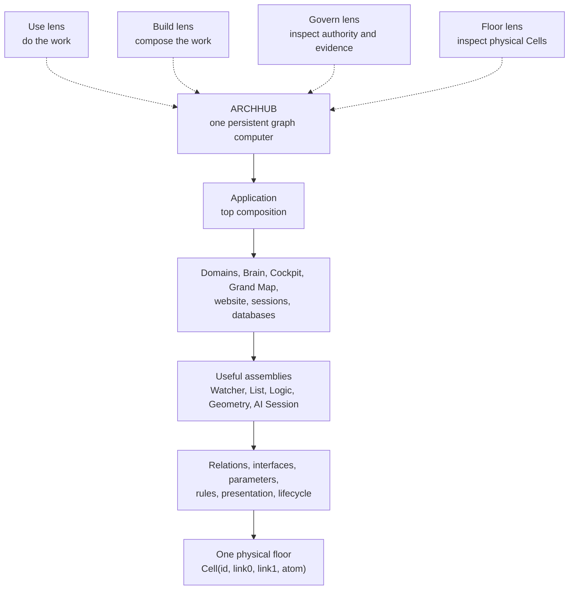

The entire building is one graph. A card, property, wire, domain, session, Brain,
Cockpit, database, or application is not a new physical node type. Each is a
reachable composition of the same Cells, shown through an authorised lens.

The user normally handles useful released assemblies. Raw Cells are the physical
floor for authorised experts, not the ordinary authoring experience.

Every diagram in this guide has an accessibility title and description and is
followed by equivalent prose or a table. A conforming renderer must expose that
text to assistive technology. Diagram syntax and rendered SVG accessibility still
require an artifact court; this document court cannot prove them.

## Plate 1: The One Physical Block

### What You See

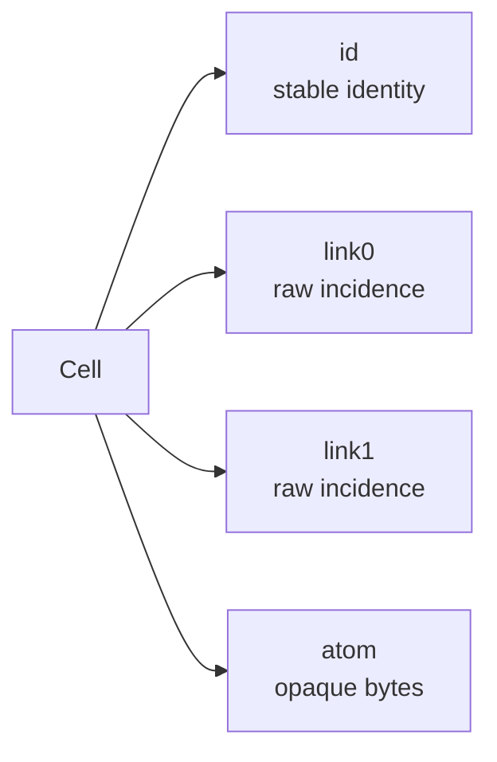

This is the only persisted semantic record:

```text
Cell {
  id: CellId
  link0: CellId
  link1: CellId
  atom: Bytes
}
```

### What It Means

The Cell is deliberately not a `Session`, `Wire`, `Group`, `Value`, `Database`,
or `UI` object. It does not carry an engine classification. Meaning comes from
the released graph protocol and the Cells around it.

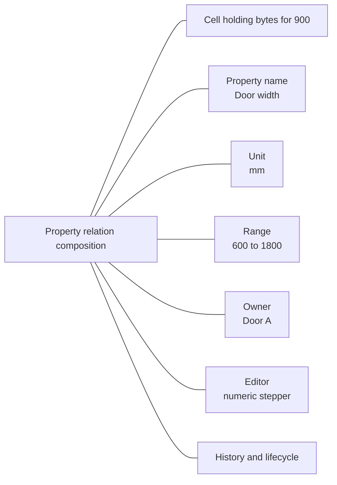

The bytes for `900` alone do not mean door width. The visible and editable
meaning is the whole relation composition.

### Why One Block Is Enough

A small physical alphabet can form rich structures. The floor stores identity,
incidence, and terminal bytes. Released graph protocols define how reachable
arrangements represent relations, rules, interfaces, properties, assemblies,
security, presentation, and lifecycle.

The floor does not replace physical machinery. DOM nodes, pixels, GPU buffers,
network sockets, process stacks, and secret key bytes remain machinery. Their
semantic contracts, requests, policies, references, and observable outcomes are
Cells.

### User Control

Ordinary users edit useful values and assemblies. Build users open compositions
and inspect their relations. Govern and Floor users can descend to evidence,
authority, physical identities, links, and atoms. No user should need raw Cell
knowledge to do ordinary work.

## Plate 2: One Root, Four Lawful Views

### What You See

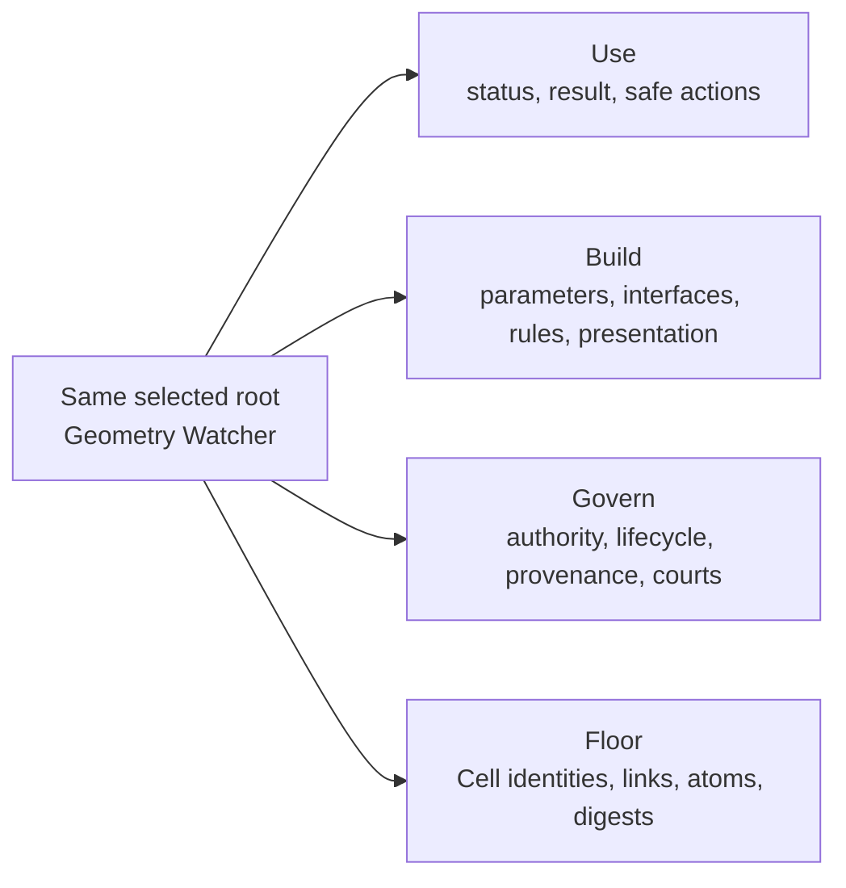

### What It Means

These are not four copies. They are authorised projections of the same roots at
the same accepted revision.

| Lens | Intended experience | Typical information |
|---|---|---|
| Use | Perform ordinary work | useful names, values, state, safe actions |
| Build | Compose and configure | assemblies, interfaces, relations, parameters, logic |
| Govern | Understand control and consequence | access, lifecycle, provenance, courts, history |
| Floor | Inspect the physical substrate | Cell identity, raw links/atoms, kernel evidence |

Visibility is an authority decision, not CSS hiding. Hashes and raw identities
appear only when the authorised Govern/Floor lens, audience, scope, and grant
permit them. A user request can seek access but cannot broaden authority.

### User Control

The authorised user can move down through these lenses without entering a second
settings system. The current lens, selected roots, active scope, active
Properties tab, and allowed depth are themselves graph relations on the user's
view-session composition.

## Plate 3: Composition Is Scale, Not a Container Type

### What You See

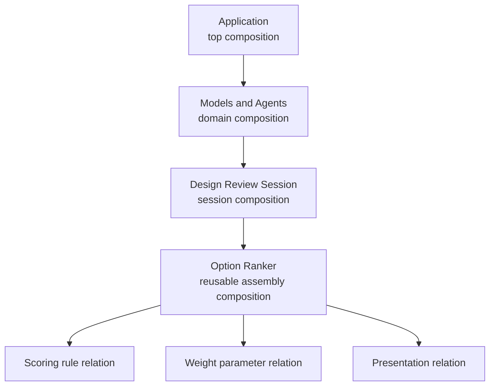

### What It Means

The application, a domain, a session, an assembly, and a parameter use the same
composition mechanism at different scales. A composition is a reachable graph
region interpreted by released protocols.

Opening a composition changes the active scope. It does not create a second
graph, database, engine, or copied truth.

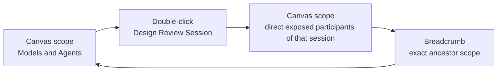

### Group And Ungroup

Grouping creates a WIP composition boundary around selected roots. It preserves
their identities and relations. Crossing relations derive public boundary
interfaces. Ungroup removes only that boundary through an undoable revision; it
does not recreate the contents or destroy their wires.

### User Control

Double-click or Enter opens a composition. Breadcrumbs return to an ancestor.
Wheel zoom changes only viewport scale. It must never secretly open a domain or
change graph scope.

## Plate 4: A Wire Is A Real Editable Relation

### What You See

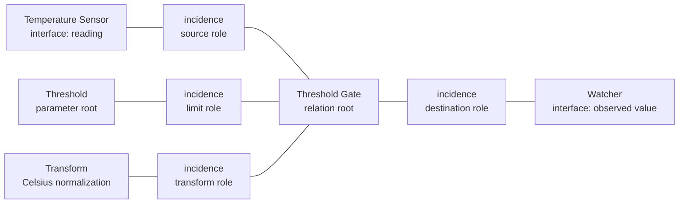

The visible cable is a presentation of the relation root and its explicit
incidences. It is not a decorative line guessed by the renderer.

### What A Relation Can Carry

- Participant roles and arbitrary arity.
- Direction or polarity where the protocol defines it.
- Ordering and cardinality.
- Data contract and units.
- Gate, transform, encryption policy, and provenance.
- Lifecycle, history, authority, and cable presentation.
- Relations to other relations.

### User Control

Selecting a cable selects the relation composition. The Properties rail can then
show its participants, roles, transform, gate, security, presentation, and
history. Rewire changes explicit incidences through one expected-revision,
undoable transaction. The cable cannot claim a connection when no authorised
relation exists.

## Plate 5: The Properties Rail Is Also A Composition

### What You See

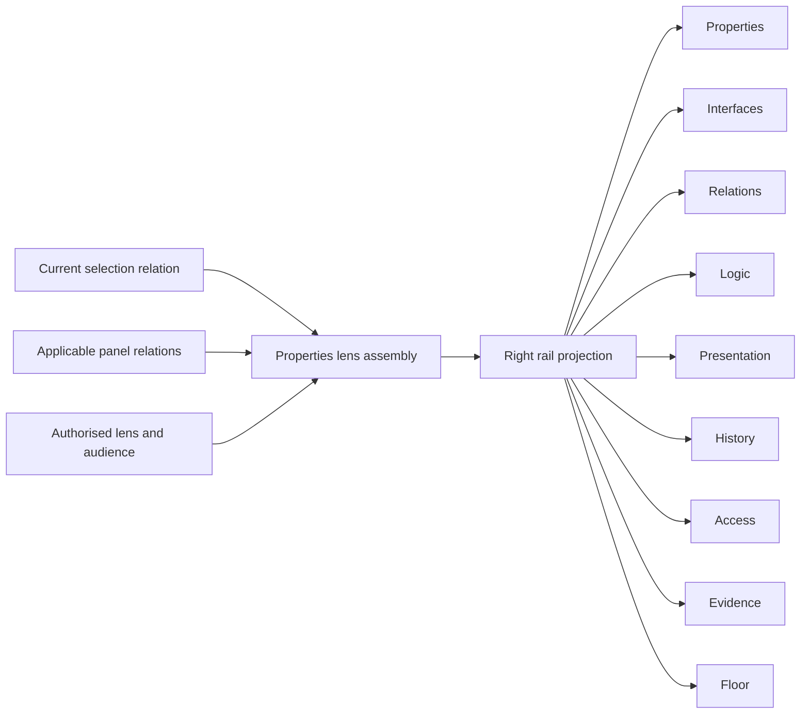

### What It Means

The right rail is not a hard-coded JSON report. Panel definitions, order,
labels, visibility, selected tab, editors, and writes are graph relations.
Only panels applicable to the selected root and current authority appear.
Empty and decorative tabs are forbidden.

### User Control

- Select a node card to edit its permitted useful properties.
- Select a socket to inspect the real interface.
- Select a wire to inspect the real relation.
- Select a parameter to inspect its contract, value, history, and presentation.
- Select several roots to see only common editable properties; mixed values show
  `Varies`.
- Edit color, icon, label, card/cable presentation, or token binding in the
  Presentation panel when authorised.

One visible edit commits the authoritative value or relation. It does not update
a second settings object.

## Plate 6: The Catalogue Contains Preassembled Building Blocks

### What You See

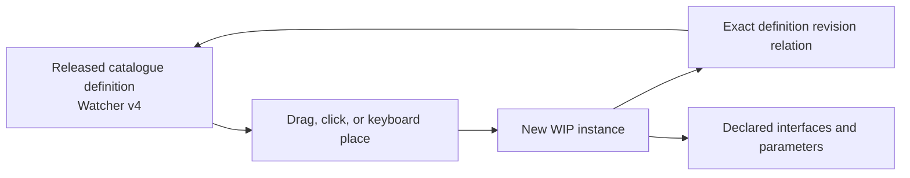

### What It Means

The catalogue is the higher-level constraint layer. It contains reviewed,
released, reusable compositions built from the one physical Cell and explicit
relations. It is not a list of physical node kinds and not a domain index.

Useful catalogue assemblies can include:

- Watcher and attention assemblies.
- Ordered lists, logic, transforms, and rules.
- Versioned data assets and database transaction protocols.
- Geometry and image descriptors and flows.
- AI session and coordination assemblies.
- UI components and presentation systems.
- BIM workflows and future domain assemblies.

These names do not extend the physical schema. Users and agents instantiate the
exact released definition revision, then configure its declared interfaces and
parameters.

### User Control

The left library supports category browsing, search, favourites, documentation,
and drag/keyboard placement. A user can open an assembly to inspect how it is
built. Novel work begins as visible WIP and cannot silently publish itself.

## Plate 7: One Application, Not Separate Dashboards

### What You See

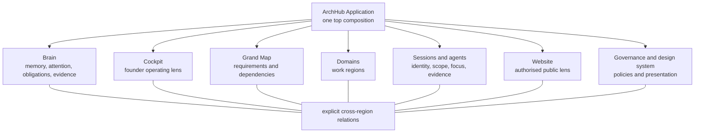

### What It Means

Brain, Cockpit, Grand Map, domains, sessions, website, governance, and design
system are openable regions and lenses of the same root graph. They may present
different information for different audiences, but they cannot own copied truth
or exchange pretend status reports.

An external model or CLI may temporarily possess an authorised session
composition. The process is not the session and cannot mint authority. Its
scope, capabilities, focus, obligations, context, proposals, cost, evidence,
and lifecycle remain graph compositions.

## Plate 8: A Gesture Travels Through One Governed Pipeline

### What You See

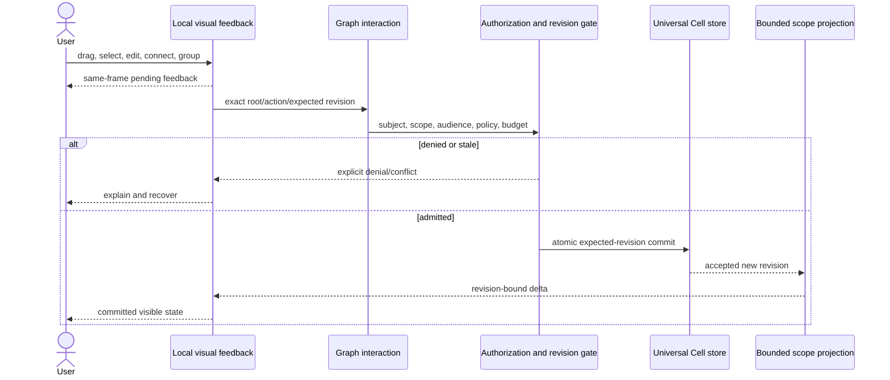

### What It Means

Hover, pointer preview, marquee rectangle, drag preview, wire preview, and
uncommitted pan/zoom painting can be local and disposable. Committed selection,
focus, viewport where policy requires persistence, and active scope are
authoritative graph-held relations on the view-session composition. Their
bounded projection must not rebuild the entire operating graph, but the browser
cannot own or grant them. Cross-scope changes, authorization, integrity, and
conflict checks remain global where required.

### User Control

Every denied, stale, or incompatible action must explain why. Undo appends a new
revision; it never erases history. Direct manipulation should feel immediate:

| Interaction court | Release target |
|---|---|
| Pan, zoom, marquee, drag, wire preview | p95 frame <= 16.7 ms |
| Selection feedback | same frame |
| Local mutation acknowledgement | p95 <= 100 ms |
| Bounded composition entry | p95 <= 150 ms |
| Steady pointer work | no long task over 50 ms |

These are normative targets, not current pass claims.

## Plate 9: WIP, Shared, And Published Are Revision Views

### What You See

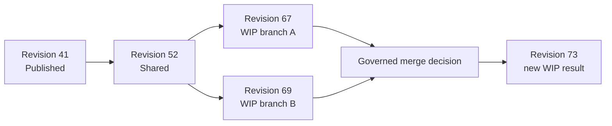

### What It Means

WIP, Shared, Published, Archive, deployment, operational state, trust/visibility,
and external outcome are separate protocols. They must not be collapsed into one
status string or three fragile mutable copies.

Changes to application settings, colors, components, rules, or policies begin as
a scoped WIP revision. They do not silently broadcast to every user. Review,
evidence, promotion, rollback, and exact revision identity remain visible.

Database writes, payments, BIM exchanges, AI actions, and deployments separate
request, authorization, attempt, provider outcome, reconciliation, and current
projection. A graph label saying `done` is not proof that a physical effect
happened.

## Plate 10: Adapters Are Narrow Doors, Not The Building

### What You See

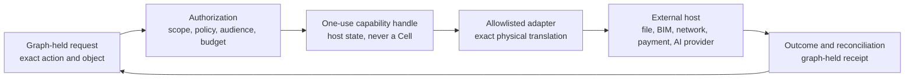

### What It Means

Adapters cross physical boundaries. They translate one admitted operation. They
do not own product workflow, lifecycle, presentation, security policy, or domain
meaning. Unknown adapters and actions fail closed.

Secret bytes, bearer tokens, private keys, and live capability handles do not
enter ordinary Cells, URLs, logs, prompts, or command lines. Cells hold protected
references, public fingerprints, policy, redacted evidence, requests, and
observable outcomes.

## Plate 11: How To Tell A Real Node-Native Feature From A Shell

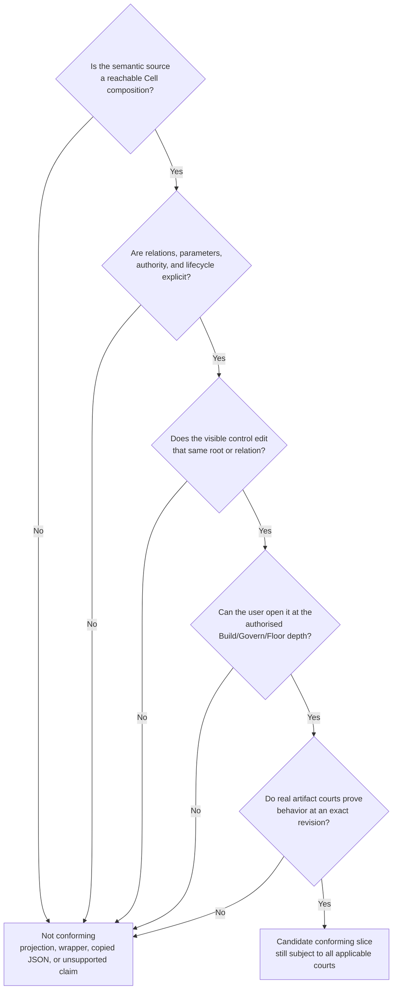

Connected diagrams, generated HTML, wrappers, copied JSON, backend-only tests,
and labels such as `complete` do not prove the system. A conforming slice needs
one authority, visible causality, lawful lenses, exact revision evidence, and
the applicable browser, security, recovery, concurrency, adapter, and artifact
courts.

## Plate 12: Source And Proof Chain

```mermaid
flowchart LR
    accTitle: Authority requirement and evidence chain
    accDescr: Founder decisions flow through precedence, specification, obligations, exact artifacts, executable evidence, and honest status.
    F["Founder decision and Core Values"]
    A["AUTHORITY.md<br/>precedence"]
    S["SPEC.md<br/>normative target"]
    O["Graph obligation<br/>and applicable court"]
    R["Exact source revision,<br/>artifact, and environment"]
    E["Executable evidence"]
    P["Status projection<br/>with open boundaries"]

    F --> A --> S --> O --> R --> E --> P
```

This guide explains the target. It does not prove:

- that every required composition is implemented;
- that current implementation matches every diagram;
- that the editor meets latency and usability targets;
- that security, cloud, multi-user, recovery, adapters, installer, or deployment
  courts are green;
- that ArchHub is complete, published, deployed, or patentable.

Current truth must come from revision-bound evidence generated against the exact
source and actual artifact. A focused document court can prove this guide's
structure and source binding; it cannot prove product behavior.

## Source Map

### Precedence Index

[AUTHORITY.md](./AUTHORITY.md) alone defines the complete active precedence and
change protocol. This guide does not replace or shorten that index. In its
current order, the index distinguishes:

1. Current explicit founder decisions and the founder Core Values source.
2. [SPEC.md](./SPEC.md), the normative Universal Cell product target.
3. [Workspace Standard](../../00.GOVERNANCE/WORKSPACE-STANDARD.md), which
   controls workspace placement, privacy, and CDE custody.
4. Released detailed protocol, design, and security decisions incorporated by
   the specification, within their delegated scope.
5. The [Grand Map source graph](../../30.KNOWLEDGE/grand-map/data/grand_domains.json),
   which controls product requirements, dependencies, parameters, and domains.
6. Revision-bound implementation evidence, which controls only what an exact
   artifact passed in an exact environment.
7. Research and adversarial evidence, which does not become authority unless
   promoted through the defined protocol.

### Explanatory Artifact

- [Node Language Handbook](./NODE-LANGUAGE-HANDBOOK.md): a WIP recursive
  WHAT/WHY/HOW/WHO/WHEN/WHERE/PROOF explanation. It is not a controlling source
  and cannot replace `AUTHORITY.md` or `SPEC.md`.

### Accepted Detailed Design

- [Node-native design system, visibility, and interaction architecture](../../30.KNOWLEDGE/strategy/node-native-design-system-visibility-interaction-architecture-2026-07-16.md):
  visual grammar, progressive visibility, Properties, catalogue, interaction,
  performance, security, and ordered courts.
- [Versioned state and security authority](../../30.KNOWLEDGE/strategy/node-language-versioned-state-security-authority-2026-07-15.md):
  lifecycle, branching, external outcomes, authorization, and adapters.

### Research Lineage, Not ArchHub Authority

- [A History of Lisp](https://dl.acm.org/doi/10.1145/38807.38828):
  small compositional symbolic structures.
- [Kernel language](https://web.cs.wpi.edu/~jshutt/kernel.html):
  first-class operative model.
- [Interaction nets](https://doi.org/10.1006/inco.1997.2643):
  explicit graph interaction precedent.
- [Blender 4.5 Node Groups](https://docs.blender.org/manual/en/4.5/interface/controls/nodes/groups.html):
  openable reusable composition interaction.
- [W3C Pointer Events](https://www.w3.org/TR/2026/CRD-pointerevents3-20260522/):
  pointer capture and input-event semantics.
- [Design Tokens Format Module 2025.10](https://www.designtokens.org/tr/2025.10/format/):
  typed design token interchange precedent. External source currency must still
  be reverified at release.

## Bounded Documentation Court

`tests_replica/test_node_language_visual_guide.py` binds the reviewed visual
guide revision to exact reviewed `AUTHORITY.md`, `SPEC.md`, and handbook
revisions. It checks the required plates, diagrams, source precedence
classification, committed-versus-disposable interaction language, separate
default panel mapping, source links, current reviewed external references,
accessibility metadata, core concepts, performance restatements, and honest
non-proof boundary.

That court proves only document structure and source binding. It does not prove
the Mermaid syntax parses in the release renderer, the rendered SVG is accessible,
or the diagrams are implemented, usable, secure, performant, or releasable.
