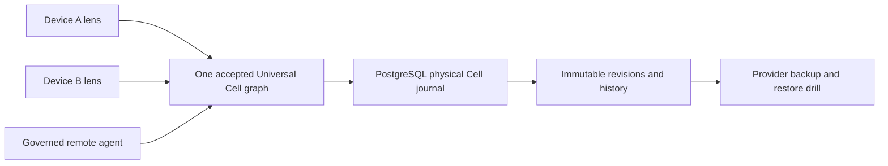
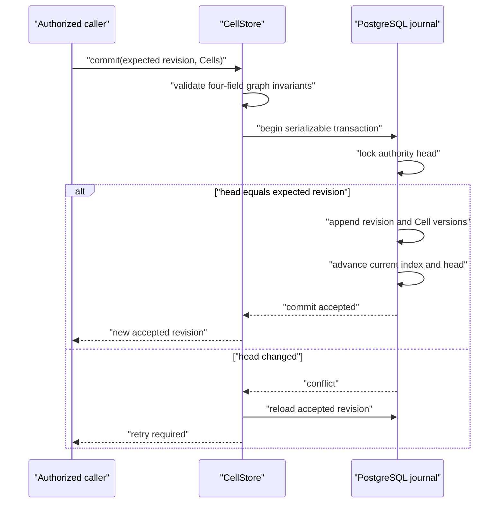
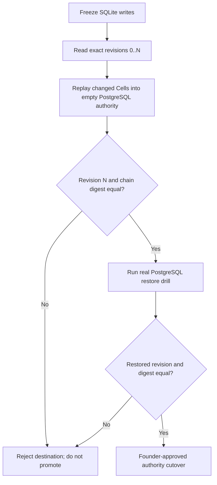

# PostgreSQL Universal Cell Authority

Status: WIP mechanism, not deployed, not release evidence
Recorded: 2026-07-26
Controlling sources: `AUTHORITY.md`, `SPEC.md`

This record explains the physical cloud-authority work. It is not a new
semantic authority and cannot overrule the specification or acceptance courts.

## Visual Summary



The devices and agents do not receive separate copies that become authorities.
They read and propose transactions against one accepted graph revision.
PostgreSQL stores the physical Cell journal. Product meaning remains composed
from `Cell(id, link0, link1, atom)`.

## Macro Contract

### What

A storage-neutral `CellStore` physical journal and a PostgreSQL implementation
for one persistent, shared-writer Universal Cell authority.

### Why

The existing SQLite journal is durable on one machine but deliberately holds
one exclusive OS owner. That cannot provide cross-device continuation or
multiple governed application workers. A managed PostgreSQL authority can
preserve the same atomic revision contract while moving durability off one
desktop.

### How

1. `CellStore` accepts one physical `CellJournal`.
2. The journal stores only authority head, revisions, Cell versions, and the
   current physical Cell index.
3. Every commit compares the expected accepted revision inside one serializable
   transaction.
4. One PostgreSQL session advisory fence protects the graph-held application
   runtime owner. A second live runtime cannot steal ownership; process death
   releases the physical fence so graph recovery can proceed.
5. A stale writer is rejected, refreshes to the accepted revision, and must
   retry through normal authorization and conflict handling.
6. Migration copies every immutable revision into a genesis-only destination
   and compares the complete revision-chain digest.
7. Runtime ownership courts use a secret-free authority identity rather than
   assuming every durable authority is a local SQLite path.

### Who

- Founder: approves authority cutover and recovery acceptance.
- Application runtime: holds graph-defined runtime ownership and submits
  authorized transactions.
- PostgreSQL provider: supplies physical durability, encryption, backup, and
  point-in-time recovery capabilities.
- Agents and devices: clients of the application authority; they do not become
  database owners or bypass graph governance.

### When

- Implement and court locally before deployment.
- Migrate only while the SQLite source is write-frozen.
- Cut over only after exact revision/digest equality and a real provider restore
  drill.
- Release only after Device A can stop and Device B can continue from the same
  accepted root without manual file copying.

### Where

- Physical floor: `nodelang/universal_cell.py`
- PostgreSQL journal: `nodelang/postgres_cell_journal.py`
- Runtime ownership boundary: `nodelang/universal_application.py` and
  `nodelang/application_server.py`
- Courts: `tests_replica/test_universal_cell_cloud_authority.py` and
  `tests_replica/test_postgres_cell_journal.py`

## Micro Contract

### Physical Tables

| Table | What | Why |
|---|---|---|
| `archhub_cell_authorities` | One physical authority head | Atomic expected-revision comparison |
| `archhub_cell_revisions` | Ordered immutable revision records | History continuity |
| `archhub_cell_versions` | Four Cell fields at each changed revision | Exact semantic journal |
| `archhub_current_cells` | Disposable current-version index | Fast reopen without changing authority |

No table assigns node kinds, roles, domains, sessions, permissions, lifecycle,
users, or product behavior. Those remain graph compositions.

### Transaction



The authority-head row lock protects one graph transaction. The session
advisory fence separately protects one live application runtime. Neither
replaces graph authorization or the graph-held ownership history.

### Migration



## Evidence From This Run

Accepted source-light evidence:

- Existing SQLite durability and concurrency behavior remained green.
- Storage-neutral journal injection, stale-writer refresh, exact history
  migration, and remote-backup rejection are green.
- Runtime ownership accepts a shared durable journal without weakening SQLite's
  owner-fence requirement.
- A second shared-authority runtime fence is denied until the current holder
  releases it.
- PostgreSQL authority identity is stable and does not contain the DSN.
- PostgreSQL schema is pinned to physical journal tables and columns.
- Python compilation passes for the changed authority modules.

Current focused result:

```text
19 passed, 4 skipped
34 passed, 4 skipped including prior SQLite durability/concurrency regressions
7 passed, 1 skipped for AWS KMS HMAC custody
3 passed for sealed cloud configuration and constructor order
14 passed, 1 skipped for the external revision witness
58 passed, 6 skipped for the combined source-light foundation
```

The five skips are material: `ARCHHUB_TEST_POSTGRES_DSN` and
`ARCHHUB_TEST_AWS_KMS_HMAC_KEY_ARN` are not configured, and no admitted external
PostgreSQL/KMS court environment exists. They are not counted as integration
proof.

## Unaccepted Gates

- Real PostgreSQL create/replace/reopen and opaque-byte round trip.
- Real two-connection stale-revision conflict under PostgreSQL.
- Transaction interruption before commit and ambiguous connection failure after
  commit.
- Managed backup, point-in-time recovery, and restore equality.
- SQLite-to-PostgreSQL migration against the actual ArchHub graph.
- Application boot directly from the admitted remote authority.
- Two-device continuity with the first device unavailable.
- Remote agent producing a signed artifact through the same graph authority.
- Multi-region failure and revocation drills.

Until these gates pass, the application still depends on local SQLite for its
running Universal Cell authority.

## Shared Runtime Startup Gate

### Measured current defect

`ApplicationServer` currently acquires the physical runtime fence after an
injected shared `CellStore` and registry already exist. A caller could therefore
run application build or restore mutations before ownership is fenced. The
later graph ownership claim cannot retroactively protect those writes.

### Required design

1. Open one storage-neutral `CellStore` over the admitted shared journal.
2. Acquire an opaque runtime-fence lease for `app:archhub`.
3. Build or restore the Universal Application while that exact lease is held.
4. Hand the still-active lease, same `CellStore`, and resulting registry to
   `ApplicationServer`.
5. The server consumes the lease once and rejects a shared store without it.
6. Any build, restore, admission, or server-construction failure releases the
   physical fence and closes the failed store.

The lease is a process capability, not semantic product data. It MUST NOT be
persisted in Cells, serialized, logged, copied across authorities, or accepted
for another application root.

### Red-to-green courts

- The builder observes the runtime fence already held before its first graph
  mutation.
- A restore observes the same condition.
- A lease cannot be consumed twice, by another `CellStore`, or for another
  resource root.
- Build/restore failure releases the fence.
- `ApplicationServer` rejects an unfenced shared authority before it claims or
  mutates graph ownership.
- Successful handoff retains one physical fence through graph ownership and
  releases it once during orderly close.

This changes no Cell shape, product protocol, graph lifecycle, public route, or
semantic authority.

## Deployment Boundary Decision

The current product footprint already uses Fly.io. The smallest researched
production boundary that avoids a new product authority is:

- Fly.io Managed Postgres for the physical Cell journal;
- Fly Machine OIDC for short-lived AWS credentials, restricted to the exact
  ArchHub app/machine subject;
- AWS KMS HMAC keys for legacy graph-authority HMAC operations;
- Fly secrets only for the database connection capability, never for exported
  signing-key bytes;
- one fenced Universal Application owner serving every remote lens.

`AwsKmsHmacSigningKeyProvider` implements the non-exporting signing contract.
Logical graph key IDs and versions map to exact KMS key ARNs. KMS signs a
domain-separated SHA-256 digest, so arbitrary graph evidence remains within the
KMS message limit. The real KMS court remains skipped until OIDC trust, a
least-privilege KMS key policy, and an admitted test key exist.

`external_revision_witness.py` wraps the existing journal with a physical
two-phase witness. It prepares the exact next revision-chain digest before the
PostgreSQL append and confirms it afterward. Startup admits only an exact
confirmed head or one of the two documented pending crash states. Rollback,
split history, unexplained forward history, missing established witness, and
malformed provider state fail closed. DynamoDB reads are strongly consistent
and every mutation uses an exact conditional expression. The complete
What/Why/How/Who/When/Where and crash-state court is in
`EXTERNAL-REVISION-WITNESS.md`.

`cloud_runtime_bootstrap.py` validates one complete, secret-redacted environment
and can construct one fenced, externally witnessed remote server from
PostgreSQL plus DynamoDB plus KMS. Normal startup cannot auto-provision a
missing witness. It is intentionally not selected by `application_server.main`;
activation remains blocked on real PostgreSQL, DynamoDB/PITR, KMS/OIDC,
recovery, authenticated entry, and deployment courts.

This is a target boundary, not a deployed claim. Fly organization access, AWS
account/key creation, managed database provisioning, DNS/TLS, recovery drills,
and external security acceptance remain outside the current evidence.

## Primary References

- PostgreSQL transaction isolation:
  https://www.postgresql.org/docs/current/transaction-iso.html
- PostgreSQL explicit locking:
  https://www.postgresql.org/docs/current/explicit-locking.html
- PostgreSQL continuous archiving and point-in-time recovery:
  https://www.postgresql.org/docs/current/continuous-archiving.html
- Psycopg transaction management:
  https://www.psycopg.org/psycopg3/docs/basic/transactions.html
- Psycopg installation:
  https://www.psycopg.org/psycopg3/docs/basic/install.html
- Fly.io Managed Postgres:
  https://fly.io/docs/mpg/
- Fly.io OpenID Connect:
  https://fly.io/docs/security/openid-connect/
- Fly.io secrets:
  https://fly.io/docs/apps/secrets/
- AWS KMS HMAC keys:
  https://docs.aws.amazon.com/kms/latest/developerguide/hmac-create-key.html
- AWS KMS VerifyMac:
  https://docs.aws.amazon.com/kms/latest/APIReference/API_VerifyMac.html
- DynamoDB conditional expressions:
  https://docs.aws.amazon.com/amazondynamodb/latest/developerguide/Expressions.ConditionExpressions.html
- DynamoDB strongly consistent reads:
  https://docs.aws.amazon.com/amazondynamodb/latest/developerguide/HowItWorks.ReadConsistency.html
- DynamoDB point-in-time recovery:
  https://docs.aws.amazon.com/amazondynamodb/latest/developerguide/Point-in-time-recovery.html

These sources explain physical database behavior. They do not define ArchHub
semantic authority; `SPEC.md` does.
