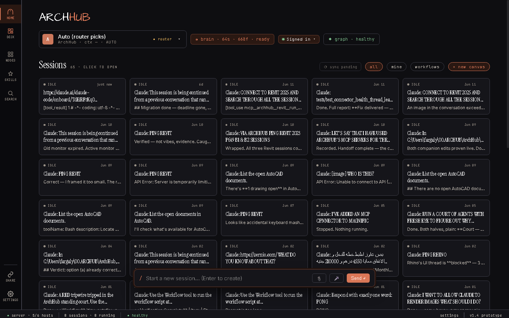
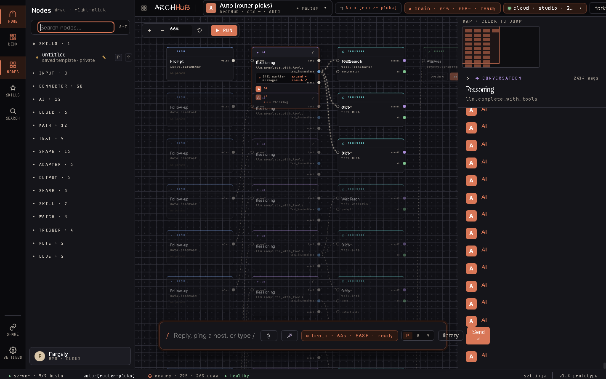
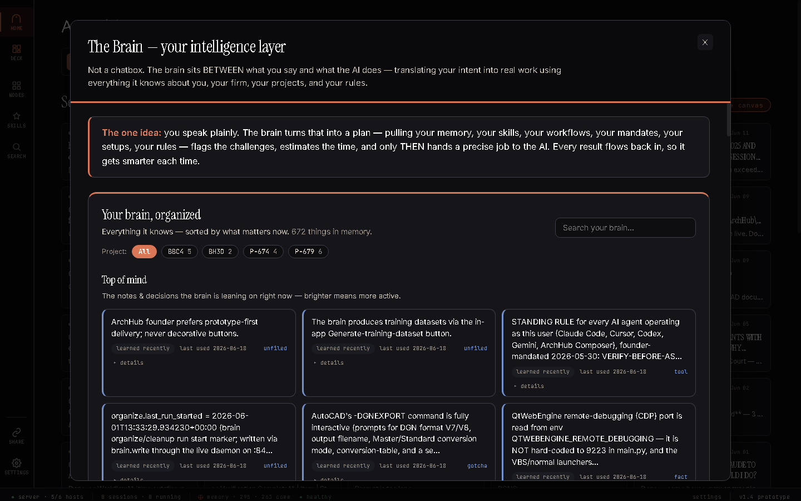
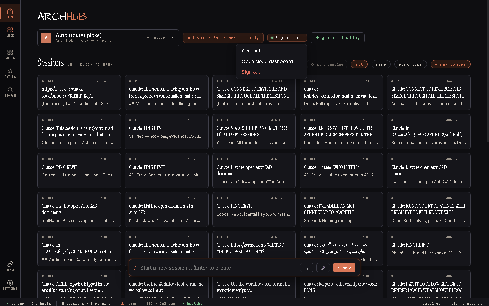
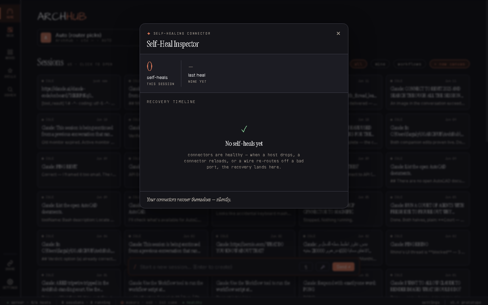

# ArchHub — guide-throughs (v1.6)

> Reference — not the roadmap; see [docs/ROADMAP.md](ROADMAP.md).

Step-by-step walkthroughs of every surface, with screenshots from the live
v1.6.1 app. For the deeper technical reference, see
[BACKEND_SPEC.md](BACKEND_SPEC.md), [USER_DATABASE.md](USER_DATABASE.md),
[PERMISSIONS.md](PERMISSIONS.md), [CLOUD_API.md](CLOUD_API.md), and
[BRAIN.md](BRAIN.md).

---

## 1. The home screen — sessions + status

When you open ArchHub you land on Home: every session as a card, and a status
bar across the top.

The top bar, left to right:

- **Model strip** — the model the AI will use. `Auto (router picks)` lets the
  router choose; click it to pin a specific model.
- **Brain chip** — `brain · 64s · 668f · ready` means the brain is live with 64
  skills and 668 facts. It shows real counts the moment the app opens.
- **Account chip** — `Signed in` (and your plan + remaining messages once the
  meter loads). Click it for account / sign-out. Covered in section 5.
- **Graph health** — `graph · healthy`. Click it to open the Self-Heal Inspector
  (section 7).

Each session card shows its state (idle / running), when it was last touched,
the title, a preview of the last message, and the hosts it used. Click any card
to open it. `+ new canvas` starts a fresh one; `Sync sessions` (section 6) pushes
them to the cloud.

---

## 2. The canvas — nodes, wires, run

Opening a session drops you on its canvas: a graph of typed nodes (hosts, AI
steps, filters, connector operations) wired together.

- **Place** a node from the library (Cmd-K, or the Nodes rail on the left).
- **Wire** an output socket to an input socket — every wire is a real data
  segment, saved with the session.
- **Run** the graph (or a single node); results materialise on the canvas and
  persist.
- **Edit inline** — right-click a node, drag to rewire, edit params in the
  inspector. Every change auto-saves to the session.

The canvas is the materialised, inspectable surface; the composer (chat) drives
and edits it.

---

## 3. The Brain — your intelligence layer

The brain sits between what you say and what the AI does. Click the brain chip
to open it.

- **Top of mind** — the notes and decisions the brain is leaning on right now;
  brighter cards are more active. Each shows when it was learned and last used.
- **Project filter** — narrow to one project (BBC4, BH3D, P-674, P-679, …).
- **Search your brain** — find any memory by meaning, not just keyword.
- **Back up my brain** — encrypted sync of your brain to the cloud, so it follows
  you across machines.

You never have to manage the brain by hand. It grows as you work: every
successful result flows back in, so it gets smarter each session.

---

## 4. The Router — models + fallback

ArchHub routes each request to the right model and falls back automatically when
one is unavailable.

- Leave the model strip on `Auto (router picks)` and the router chooses based on
  the task (vision, modeling, quick edits, long reasoning).
- When a provider is out of credit or refuses a tool, the router switches and
  shows a short note under the answer (for example, `anthropic quota — switching
  provider…` then `answered by <model>`).
- The model strip reflects real state: the routed model, and any blocked
  providers greyed with the reason.

You always know which model answered and why — no silent black box.

---

## 5. Your account + the cloud

ArchHub Cloud holds your account, plan, usage, and (opt-in) brain backup. The
account chip on the top bar is your entry point.

- **Signed in** with your email, plan (Solo / Studio / Firm), and remaining
  messages.
- Click the chip to open the account menu / Settings → Account for billing and
  sign-out.
- Sign-in is a real browser flow (magic-link or Google); your token is stored
  encrypted on the machine. See [CLOUD_API.md](CLOUD_API.md).

Your data lives on a persistent, encrypted cloud database that survives
redeploys — details in [USER_DATABASE.md](USER_DATABASE.md).

---

## 6. Sessions in the cloud

Sessions are saved locally as node graphs and can sync to the cloud so they
follow you between machines.

- On Home, click **Sync sessions** in the Sessions header. A `synced <when>`
  badge shows the last sync.
- Large attachments are skipped past a size cap so the sync stays fast (the skip
  is logged, never silent).
- Sessions still work fully offline; cloud sync is the cross-device layer.

---

## 7. Self-Heal Inspector

ArchHub repairs its own connections — host reconnects, connector reloads, graph
repairs — and the inspector shows them as a live timeline. Click the
`graph · healthy` chip to open it.

- A **stat header** — total self-heals this session, when the last one happened,
  and counts by kind.
- A **recovery timeline** — each real recovery with its kind, target, detail, and
  time.
- An **honest empty state** — `No self-heals yet — connectors are healthy` when
  nothing has needed repair. It never shows fabricated rows.

---

## 8. Team + permissions

Open Settings → Team to manage your firm and teammates.

- **Start a firm**, then **invite teammates by email** with a role:
  owner, admin, or member.
- The **members list** shows each person's role; owners and admins can change
  roles or remove members; members are read-only.
- Seats are bounded by your plan. The model is enforced server-side — see
  [PERMISSIONS.md](PERMISSIONS.md).

---

## 9. Updating ArchHub

When a new release is available, ArchHub shows an **update banner** with a
one-click install that downloads the signed release and relaunches onto the new
version. You can also check from Settings. No manual download, no reinstall.

---

## 10. Understanding nodes & properties

Think of every node on the canvas as a **Lego brick**. Each brick has a job, a
shape, and a few dials on its face. You build by snapping bricks together —
nothing is hidden, everything is on the surface.

- **Studs (ports) are how bricks connect.** The little sockets on a node's left
  are inputs; the ones on its right are outputs. You wire an output stud to an
  input stud, and real data flows along that wire. The shapes have to fit —
  ArchHub won't let you snap two incompatible studs together (it shows a short
  reason why instead).
- **Dials (knobs) are the brick's settings.** Click any node and its panel opens
  on the right. That panel lists the node's dials — a number, a switch, a
  dropdown, a pick-a-document — everything that brick can be tuned with. Turn a
  dial and the node re-runs with the new value.

### Turning a dial into a wired input — the one gesture worth knowing

Sometimes you don't want to *type* a value into a dial — you want another node
to *feed* it. ArchHub lets you flip a dial into a real input socket:

1. Click a node (a host or connector step — for example a Revit or Excel
   operation) to open its panel.
2. Each dial has a small **`⊙`** dot next to it. **Tap the `⊙`.**
3. That dial turns into a **wired input socket** on the node. Now you can drag a
   wire into it, and whatever flows down that wire sets the value — no typing.
4. Changed your mind? Tap the `⊙` again and it goes back to a plain dial (its
   wires drop off).

That's the whole gesture: **click a node → open its panel → tap `⊙` → a socket
appears.** It's how a fixed setting becomes a live, data-driven input.

> A small honesty detail: the `⊙` only appears on connector / host steps. Those
> are the nodes whose engine actually reads wired inputs, so a socket you make
> there is guaranteed to be live. ArchHub deliberately doesn't offer it where the
> socket would be a dead end.

### The bigger picture (how the bricks stay consistent)

- Every node is a **typed modular brick** with typed studs (ports) and dials
  (knobs).
- A node's dials all come from **one definition** — so the panel always matches
  what the brick actually does.
- Any dial can be **promoted into a wired input socket** with the `⊙` gesture
  above.
- You can **select several bricks and group them into one** — a tidy composite
  you can reuse.
- Composing, saving, and re-running are all backed by **one library**, so a brick
  you make once is there next time.

---

## 11. Keeping ArchHub fast & updated

Two things keep themselves healthy in the background — you don't have to manage
either.

### It stays up to date

When a new signed release is out, ArchHub shows the **update banner** (section
9). One click downloads it and relaunches onto the new version — no manual
download, no reinstall. The footer at the bottom always shows the **real version
you're running** (for example `v1.6.3`), so you can tell at a glance.

### It stays fast (and recovers on its own)

ArchHub has a safety net: if your graphics card would make the window come up
**blank**, it automatically falls back to a slower software-drawn mode so you
always get a working window.

The catch used to be that once it switched to the slow mode, it never switched
back — so a single one-off graphics glitch could leave the app crawling forever.
That's fixed. Now the fallback **expires on its own** and the app retries full
speed:

- After a brief hiccup, it tries the fast path again on the **next launch**.
- If it keeps failing, it waits a little longer each time before retrying — about
  an hour, then six hours, then a day, then a week — so it isn't fighting a
  genuinely broken setup, but a momentary blip never slows you down for good.

You don't have to do anything: a passing glitch heals itself, and your machine
goes back to full speed automatically.
